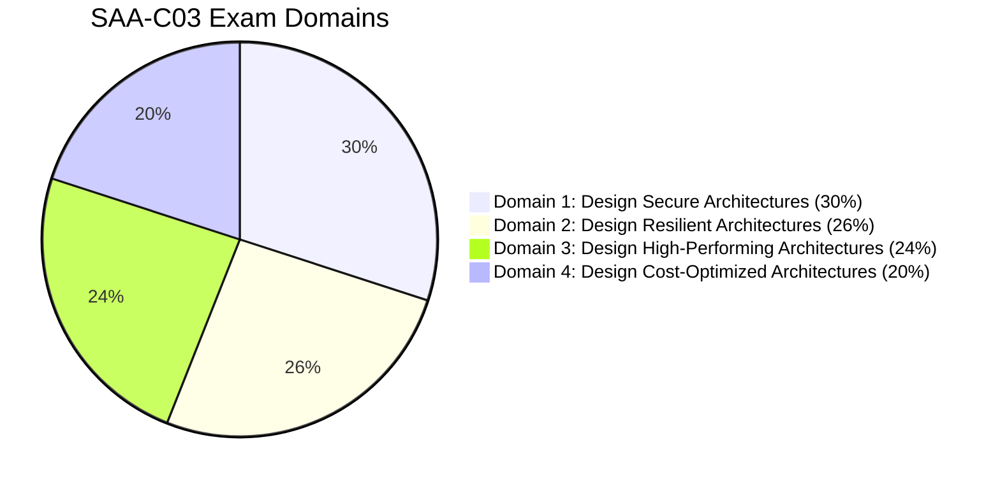

---
tags:
  - aws/moc
  - aws/index
  - hub
last_updated: 2026-08-24
status: evergreen
---

# ☁️ AWS Architecture Certification Knowledge Vault

> [!abstract] Welcome to the AWS Architecture Study Vault
> This Obsidian vault is engineered to prepare for the **AWS Certified Solutions Architect – Associate (SAA-C03)** and **Professional (SAP-C02)** certifications using principles of active recall, visual architecture graphs, and deep cross-linking.

---

## 🗺️ Master Maps of Content (MOCs)

```mermaid
mindmap
  root((AWS Architect))
    Foundations
      [[Well-Architected Framework MOC|Well-Architected]]
      [[High Availability & DR Strategies|Disaster Recovery]]
    Core Infrastructure
      [[Compute MOC|Compute]]
      [[Storage MOC|Storage]]
      [[Databases MOC|Databases]]
      [[Networking MOC|Networking & VPC]]
    Security & Ops
      [[Security MOC|Security & IAM]]
      [[Monitoring MOC|Monitoring & Governance]]
    App Architecture
      [[Integration MOC|Messaging & Integration]]
    Exam Mastery
      [[SAA-C03 High-Yield Exam Cheat Sheet|Cheat Sheet]]
      [[Decision Matrix - Database Selection|Decision Matrices]]
```

### 📂 Domain Navigation Hubs

| Domain / Area | Core Map of Content | Key Focus Areas |
| :--- | :--- | :--- |
| **00. Inbox** | [[00 - Inbox/README\|Inbox & Fleeting Notes]] | Rapid capture, practice exam clippings, unfiled notes |
| **01. Framework** | [[Well-Architected Framework MOC]] | 6 Pillars, Design Principles, Lens Reviews |
| **02. Compute** | [[Compute MOC]] | EC2, Auto Scaling, Lambda, ECS, EKS, Fargate |
| **03. Storage** | [[Storage MOC]] | S3 Deep Dive, EBS, EFS, FSx, Storage Gateway |
| **04. Databases** | [[Databases MOC]] | RDS, Aurora, DynamoDB, ElastiCache, Redshift |
| **05. Networking** | [[Networking MOC]] | VPC, Subnets, Gateways, Route 53, CloudFront, Direct Connect |
| **06. Security** | [[Security MOC]] | IAM, SCPs, KMS, Secrets Manager, GuardDuty, Macie |
| **07. Integration** | [[Integration MOC]] | SQS, SNS Fan-out, EventBridge, Step Functions, Kinesis |
| **08. Monitoring** | [[Monitoring MOC]] | CloudWatch, CloudTrail, AWS Config, Systems Manager |
| **09. Resilience** | [[High Availability & DR Strategies]] | RTO/RPO, Backup & Restore, Pilot Light, Warm Standby, Active-Active |
| **Git & Repo** | [[README\|Repository & Study Guide]] | Git workflow, Obsidian setup, recommended plugins |

---

## ⚡ High-Yield Decision Matrices & Cheat Sheets

- 📊 **[[Decision Matrix - Database Selection]]** $\rightarrow$ *SQL vs NoSQL vs In-Memory vs Graph vs TimeSeries*
- 🗄️ **[[Decision Matrix - Storage Services]]** $\rightarrow$ *S3 vs EBS vs EFS vs FSx Lustre/Windows/ONTAP*
- 📨 **[[Decision Matrix - Decoupling & Messaging]]** $\rightarrow$ *SQS vs SNS vs EventBridge vs Kinesis vs Step Functions*
- 🌐 **[[Decision Matrix - Hybrid Connectivity]]** $\rightarrow$ *VPN vs Direct Connect vs Transit Gateway vs PrivateLink*
- 🎯 **[[SAA-C03 High-Yield Exam Cheat Sheet]]** $\rightarrow$ *Instant exam keyword pairings & trap avoidance*
- ⏱️ **[[RTO & RPO Comparison]]** $\rightarrow$ *Disaster recovery tiering & architecture tradeoffs*

---

## 🎯 Exam Blueprint & Scoring Focus (SAA-C03)



1. **Design Secure Architectures (30%)**:
   - [[AWS IAM (Policies, Roles, Delegation)]], [[Network Security (Security Groups, NACLs, WAF, Shield)]], [[KMS & Secrets Manager]], [[AWS Organizations & SCPs]].
2. **Design Resilient Architectures (26%)**:
   - [[EC2 Auto Scaling & Load Balancing]], [[High Availability & DR Strategies]], [[Amazon SQS (Standard, FIFO, DLQ)]], [[Amazon RDS & Aurora]].
3. **Design High-Performing Architectures (24%)**:
   - [[Amazon DynamoDB]], [[ElastiCache & MemoryDB]], [[CloudFront & Global Accelerator]], [[Amazon EFS & FSx]].
4. **Design Cost-Optimized Architectures (20%)**:
   - [[S3 Storage Classes & Lifecycle]], [[EC2 - Elastic Compute Cloud]], [[Cost Optimization Pillar]].

---

## 🛠️ Note Taking Guidelines for this Vault
1. **Link aggressively**: Whenever you mention another AWS service or architectural concept, use wikilinks (e.g. `[[Amazon RDS & Aurora]]`).
2. **Use Callouts**:
   - `> [!tip] Exam Tip` for high-frequency exam questions.
   - `> [!warning] Architecture Pitfall` for common traps and anti-patterns.
   - `> [!example] Scenario` for case-study questions.
3. **Use Templates**: Create new notes with [[Template - Service Deep Dive]] or [[Template - Architecture Scenario]].
