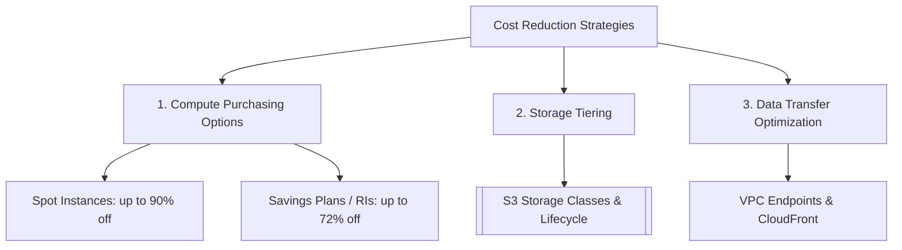

---
tags:
  - aws/well-architected
  - aws/cost
status: evergreen
exam_priority: ⭐⭐⭐⭐⭐
---

# Cost Optimization Pillar

> [!abstract] Core Definition
> The ability to run systems to deliver business value at the lowest price point, eliminating unneeded spend and optimizing resource utilization throughout the workload lifecycle.

---

## 🧭 Key Design Principles
1. **Implement Cloud Financial Management (FinOps)**: Allocate costs to teams using cost allocation tags and AWS Cost Categories.
2. **Adopt a consumption model**: Pay only for the computing resources consumed; scale down or shut off non-production resources outside business hours.
3. **Measure overall efficiency**: Measure workload output against the total cost to run it.
4. **Stop spending money on undifferentiated heavy lifting**: Use managed services (e.g., RDS instead of self-hosted database on EC2).
5. **Analyze and attribute expenditure**: Track costs with AWS Cost Explorer and AWS Budgets.

---

## 💰 Cost Optimization Levers

### 1. Compute Savings
- **Spot Instances**: Ideal for stateless, fault-tolerant, batch, or CI/CD workloads (up to 90% discount).
- **Compute Savings Plans / EC2 Instance Savings Plans**: Commitment of 1 or 3 years (up to 72% discount).
- **Auto Scaling**: Scale to zero or reduce min capacity during off-peak hours.

### 2. Storage Savings
- Transition aging data automatically using [[S3 Storage Classes & Lifecycle]].
- Delete unattached EBS volumes, old EBS snapshots, and incomplete S3 multipart uploads.
- Move from gp2 to **gp3** EBS volumes (20% lower cost per GB with independent IOPS scaling).

### 3. Data Transfer Costs
- Data transfer **IN** to AWS from Internet: **FREE**.
- Data transfer between AZs in the same Region: **$0.01/GB each way** (use private IPs or VPC Endpoints).
- Data transfer from S3 to CloudFront: **FREE**.

---

## ⚡ High-Yield Exam Tips

> [!tip] Exam Triggers
> - **"Lowest possible cost for batch processing where jobs can restart upon failure"** $\rightarrow$ **Spot Instances**.
> - **"Predictable steady-state workload for 3 years"** $\rightarrow$ **Reserved Instances / Savings Plans**.
> - **"Avoid NAT Gateway data processing charges for S3/DynamoDB"** $\rightarrow$ Use **VPC Gateway Endpoints** (free).

---

## 🔗 Related Notes
- [[Well-Architected Framework MOC]]
- [[EC2 - Elastic Compute Cloud]]
- [[S3 Storage Classes & Lifecycle]]
- [[SAA-C03 High-Yield Exam Cheat Sheet]]
