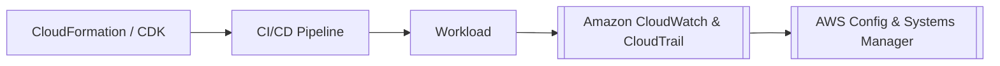

---
tags:
  - aws/well-architected
  - aws/operations
status: evergreen
exam_priority: ⭐⭐⭐⭐
---

# Operational Excellence Pillar

> [!abstract] Core Definition
> The ability to support development and run workloads effectively, gain insight into their operations, and continuously improve supporting processes and procedures to deliver business value.

---

## 🧭 Key Design Principles
1. **Perform operations as code**: Define infrastructure and operational procedures as code (IaC) using AWS CloudFormation, AWS CDK, and [[AWS Config & Systems Manager]].
2. **Make frequent, small, reversible changes**: Design workloads to allow components to be updated in small increments (e.g., using Blue/Green deployments in [[AWS App Runner & Elastic Beanstalk]]).
3. **Refine operations procedures frequently**: Hold regular post-incident reviews and evolve SOPs (Standard Operating Procedures).
4. **Anticipate failure**: Perform "pre-mortems" and chaos engineering to identify potential failure modes before they happen.
5. **Learn from all operational failures**: Share lessons across teams.

---

## 🛠️ Key AWS Services & Operational Scenarios

### 1. Preparation
- **AWS CloudFormation / CDK**: Repeatable and automated infrastructure deployments.
- **AWS Service Catalog**: Create and manage catalogs of approved IT services.
- **AWS Organizations**: Centrally manage multi-account environments ([[AWS Organizations & SCPs]]).

### 2. Operation
- **[[Amazon CloudWatch & CloudTrail]]**: Real-time operational monitoring, metric collection, and API call auditing.
- **AWS Systems Manager (SSM)**: Automated node management, Patch Manager, Session Manager.
- **AWS Health Dashboard**: Visibility into AWS service health and personalized alerts on degradations.

### 3. Evolution
- **Amazon CloudWatch Synthetics**: Canaries that monitor endpoints 24/7.
- **AWS X-Ray**: Distributed tracing across microservices to isolate latency bottlenecks.

---

## ⚡ High-Yield Exam Tips

> [!tip] Exam Keywords
> - **"Automated remediation of non-compliant resources"** $\rightarrow$ Use **AWS Config Rule + Systems Manager Automation Runbook**.
> - **"Track user activity and API calls across all regions"** $\rightarrow$ Use **CloudTrail Multi-Region Trail** with log file integrity validation.
> - **"Zero-downtime updates with quick rollback"** $\rightarrow$ Use **Blue/Green deployment** via [[Amazon Route 53 Routing Policies]] or Elastic Beanstalk swap.

---

## 🔗 Related Notes
- [[Well-Architected Framework MOC]]
- [[Monitoring MOC]]
- [[AWS Config & Systems Manager]]
