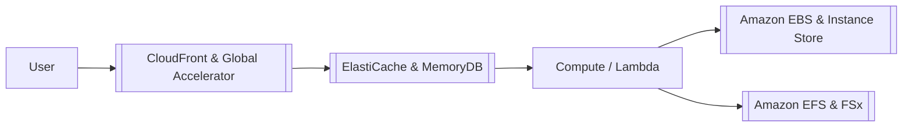

---
tags:
  - aws/well-architected
  - aws/performance
status: evergreen
exam_priority: ⭐⭐⭐⭐
---

# Performance Efficiency Pillar

> [!abstract] Core Definition
> The ability to use computing resources efficiently to meet system requirements, and to maintain that efficiency as demand changes and technologies evolve.

---

## 🧭 Key Design Principles
1. **Democratize advanced technologies**: Consume complex technologies as managed services (e.g., machine learning via Amazon SageMaker, databases via [[Amazon RDS & Aurora]]).
2. **Go global in minutes**: Deploy applications in multiple AWS regions or use edge networks like [[CloudFront & Global Accelerator]].
3. **Use serverless architectures**: Eliminate the operational burden of managing physical or virtual servers with [[AWS Lambda]] and Fargate.
4. **Experiment more often**: Spin up and evaluate new instance types or storage tiers quickly.
5. **Consider mechanical sympathy**: Match workload requirements to the right hardware architecture (e.g., AWS Graviton, GPU instances, NVMe instance store).

---

## 🚀 Performance Tiering Matrix

### Architecture Optimization Areas
1. **Compute**:
   - Right-sizing instances with AWS Compute Optimizer.
   - Auto-scaling based on metric thresholds (CPU, request count, SQS queue depth).
2. **Storage**:
   - Select volume type based on IOPS/throughput needs ([[Amazon EBS & Instance Store]]).
   - Multi-attach or shared file systems using [[Amazon EFS & FSx]].
3. **Databases**:
   - Offload read spikes to [[ElastiCache & MemoryDB]] or Read Replicas.
   - Use [[Amazon DynamoDB]] with DAX for microsecond response times.
4. **Networking**:
   - Enhanced Networking (ENA up to 100 Gbps), Elastic Fabric Adapter (EFA) for HPC/MPI workloads.

---

## ⚡ High-Yield Exam Tips

> [!tip] Exam Keywords
> - **"HPC / tightly-coupled MPI workload requiring low network latency"** $\rightarrow$ Use **Cluster Placement Group + Elastic Fabric Adapter (EFA) + FSx for Lustre**.
> - **"High read volume causing database latency"** $\rightarrow$ Add **ElastiCache (Redis)** or **Aurora Read Replicas**.
> - **"Microsecond latency for DynamoDB reads"** $\rightarrow$ Enable **DynamoDB Accelerator (DAX)**.

---

## 🔗 Related Notes
- [[Well-Architected Framework MOC]]
- [[Compute MOC]]
- [[Storage MOC]]
- [[Databases MOC]]
