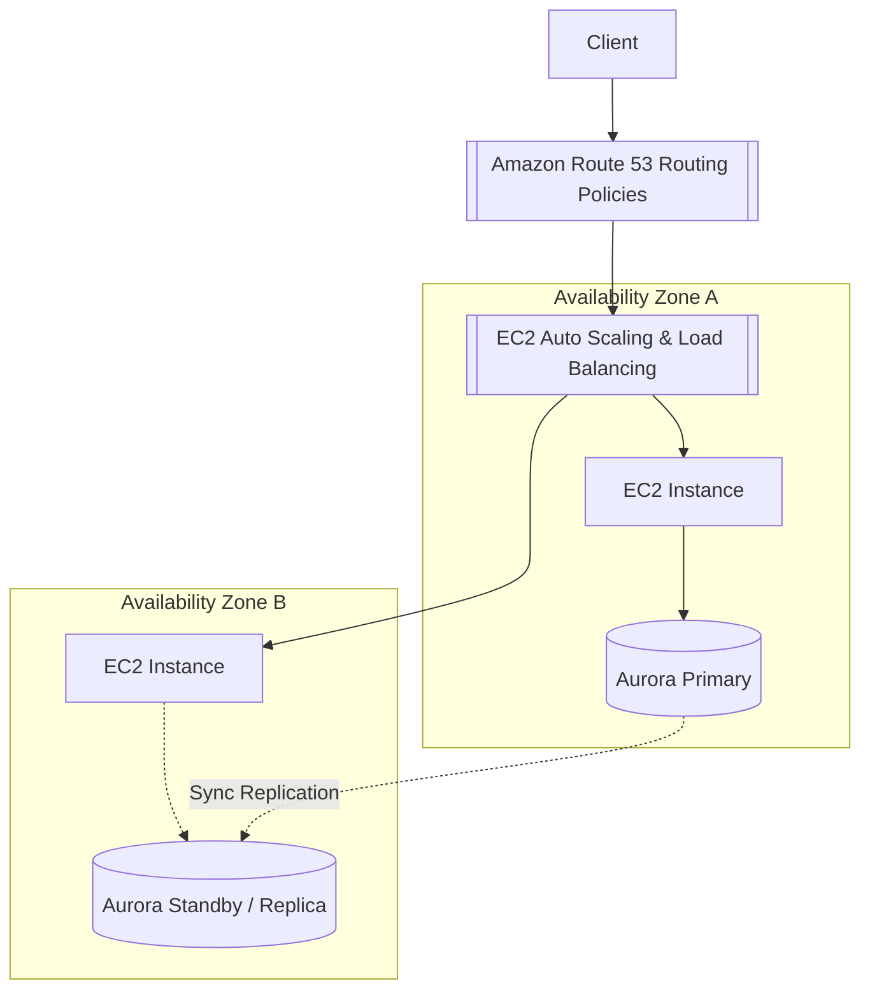

---
tags:
  - aws/well-architected
  - aws/reliability
status: evergreen
exam_priority: ⭐⭐⭐⭐⭐
---

# Reliability Pillar

> [!abstract] Core Definition
> The ability of a workload to perform its intended function correctly and consistently when it’s expected to. This includes the ability to operate and test the workload through its total lifecycle.

---

## 🧭 Key Design Principles
1. **Automatically recover from failure**: Monitor workload for KPIs and trigger automated recovery via [[EC2 Auto Scaling & Load Balancing]] or CloudWatch alarm actions.
2. **Test recovery procedures**: Simulate failures and test disaster recovery procedures in non-production environments.
3. **Scale horizontally to increase workload availability**: Replace one large resource with multiple small resources to reduce failure impact.
4. **Stop guessing capacity**: Automatically add/remove compute based on demand.
5. **Manage change in automation**: Changes should be made via infrastructure as code.

---

## 🔄 High Availability Architecture Patterns

### Core Architecture Enablers
- **Multi-AZ Deployments**: Minimum 2 AZs for high availability; 3 AZs for quorum-based workloads.
- **Decoupled Architecture**: Use [[Amazon SQS (Standard, FIFO, DLQ)]] to buffer sudden traffic surges and prevent cascading timeouts.
- **Circuit Breakers & Retries**: Exponential backoff with jitter on API calls.
- **Disaster Recovery**: Implement appropriate tier based on [[RTO & RPO Comparison]].

---

## ⚡ High-Yield Exam Tips

> [!tip] Exam Rules
> - Multi-AZ is for **High Availability (HA)** and synchronous failover within a Region.
> - Multi-Region is for **Disaster Recovery (DR)** and ultra-low latency global access.
> - To make asynchronous message consumers resilient, use **SQS with Dead-Letter Queues (DLQ)**.

---

## 🔗 Related Notes
- [[Well-Architected Framework MOC]]
- [[High Availability & DR Strategies]]
- [[EC2 Auto Scaling & Load Balancing]]
- [[Amazon RDS & Aurora]]
- [[RTO & RPO Comparison]]
