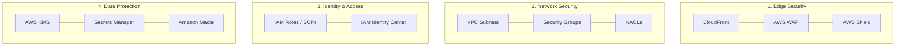

---
tags:
  - aws/well-architected
  - aws/security
status: evergreen
exam_priority: ⭐⭐⭐⭐⭐
---

# Security Pillar

> [!abstract] Core Definition
> The Security pillar focuses on protecting data, systems, and assets while taking advantage of cloud technologies to improve your security posture.

---

## 🧭 Key Design Principles
1. **Implement a strong identity foundation**: Principle of least privilege, centralized identity management, eliminate long-term credentials via IAM Roles ([[AWS IAM (Policies, Roles, Delegation)]]).
2. **Enable traceability**: Log, monitor, and alert on actions and changes in real time using [[Amazon CloudWatch & CloudTrail]].
3. **Apply security at all layers**: Defense-in-depth approach across Edge (CloudFront, WAF), VPC network (Security Groups, NACLs), compute instances, and application code.
4. **Automate security best practices**: Automated vulnerability patching and remediation using [[AWS Security Services (GuardDuty, Inspector, Macie, Security Hub)]].
5. **Protect data in transit and at rest**: Enforce TLS 1.2+, KMS envelope encryption, and bucket policies.
6. **Keep people away from data**: Reduce manual processing of sensitive data using automated processing tools.
7. **Prepare for security events**: Incident response playbooks and automated isolation.

---

## 🛡️ Security Architecture Layers

---

## ⚡ High-Yield Exam Tips

> [!tip] Exam Keywords
> - **"Enforce encryption for all objects uploaded to S3"** $\rightarrow$ Bucket policy denying `s3:PutObject` if `s3:x-amz-server-side-encryption` is not present, or enable Default Encryption with [[KMS & Secrets Manager]].
> - **"Block SQL Injection and Cross-Site Scripting (XSS)"** $\rightarrow$ Attach **AWS WAF** to ALB, API Gateway, or CloudFront.
> - **"Detect compromised EC2 instances or crypto-mining"** $\rightarrow$ Enable **Amazon GuardDuty**.
> - **"Discover exposed PII in S3 buckets"** $\rightarrow$ Run **Amazon Macie**.

---

## 🔗 Related Notes
- [[Well-Architected Framework MOC]]
- [[Security MOC]]
- [[AWS IAM (Policies, Roles, Delegation)]]
- [[Network Security (Security Groups, NACLs, WAF, Shield)]]
- [[KMS & Secrets Manager]]
