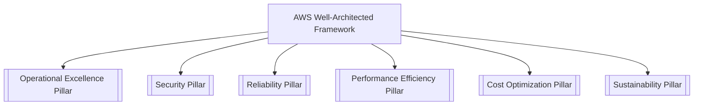

---
tags:
  - aws/moc
  - aws/well-architected
  - framework
status: evergreen
---

# 🏛️ AWS Well-Architected Framework Map of Content

> [!abstract] Overview
> The AWS Well-Architected Framework helps cloud architects build secure, high-performing, resilient, and efficient infrastructure for their applications and workloads. It is built around **6 Pillars**.

---

## 🌟 The 6 Pillars of Well-Architected

### Quick Reference Table

| Pillar | Focus | Key AWS Services |
| :--- | :--- | :--- |
| **[[Operational Excellence Pillar]]** | Running & monitoring systems, continuous improvement | [[Amazon CloudWatch & CloudTrail]], [[AWS Config & Systems Manager]], AWS CloudFormation |
| **[[Security Pillar]]** | Protecting data, systems, and assets | [[AWS IAM (Policies, Roles, Delegation)]], [[KMS & Secrets Manager]], [[AWS Security Services (GuardDuty, Inspector, Macie, Security Hub)]] |
| **[[Reliability Pillar]]** | Recovering from disruptions, dynamic scaling | [[EC2 Auto Scaling & Load Balancing]], [[High Availability & DR Strategies]], [[Amazon RDS & Aurora]] |
| **[[Performance Efficiency Pillar]]** | Structured compute, storage, DB selection | [[AWS Lambda]], [[ElastiCache & MemoryDB]], [[CloudFront & Global Accelerator]] |
| **[[Cost Optimization Pillar]]** | Avoiding unneeded spend, right-sizing | [[S3 Storage Classes & Lifecycle]], AWS Cost Explorer, Compute Optimizer |
| **[[Sustainability Pillar]]** | Minimizing environmental impacts | Graviton processors, Serverless architectures |

---

## ⚡ General Design Principles
1. **Stop guessing your capacity needs**: Use [[EC2 Auto Scaling & Load Balancing]] and Serverless architectures.
2. **Test systems at production scale**: Create on-demand test environments via CloudFormation/CDK, test, and tear down.
3. **Automate to make architectural experimentation easier**: Infrastructure as Code (IaC).
4. **Allow for evolutionary architectures**: Decouple components using [[Integration MOC]].
5. **Drive architectures using data**: Collect metrics via [[Amazon CloudWatch & CloudTrail]].
6. **Improve through game days**: Simulate production disruptions to test [[High Availability & DR Strategies]].

---

## 🔗 Related Notes
- [[00 - Home|Master Index]]
- [[SAA-C03 High-Yield Exam Cheat Sheet]]
- [[RTO & RPO Comparison]]
