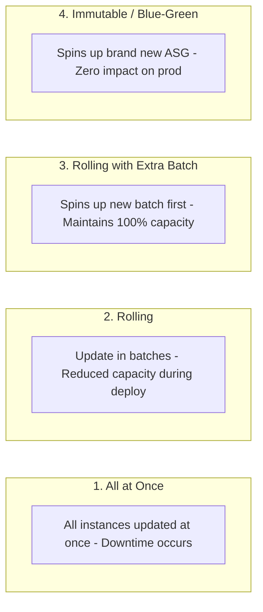

---
tags:
  - aws/service
  - aws/compute
  - aws/paas
domain: Compute
status: evergreen
exam_priority: ⭐⭐⭐
---

# AWS App Runner & Elastic Beanstalk

> [!abstract] Overview
> Platform-as-a-Service (PaaS) solutions in AWS designed to simplify application deployment without requiring deep networking or container orchestration expertise.

---

## 🥊 App Runner vs Elastic Beanstalk

| Dimension | AWS App Runner | AWS Elastic Beanstalk |
| :--- | :--- | :--- |
| **Core Abstraction** | Fully managed container application runner | Managed application environment on EC2 |
| **Underlying Tech** | AWS Fargate + Envoy proxy | EC2, Auto Scaling Groups, ELB |
| **Input Source** | Container image (ECR) or source code repo (GitHub) | Code zip file, Dockerfile, Java/Python/.NET/Node runtimes |
| **Infrastructure Control**| Minimal (AWS handles everything) | Full access to underlying EC2, VPC, and ELB configs |
| **Scaling** | Automatic concurrency-based scaling | Auto Scaling Group policies (CPU, request count) |

---

## 🚀 Elastic Beanstalk Deployment Policies

| Deployment Policy | Downtime? | Capacity Drop? | Rollback Speed | Best For |
| :--- | :--- | :--- | :--- | :--- |
| **All at once** | **Yes** | 100% capacity drop | Slow (re-deploy) | Dev/test environments |
| **Rolling** | No | Yes (drops by batch size) | Slow | Non-critical prod |
| **Rolling with additional batch**| **No** | **No (maintains full capacity)**| Slow | Prod with strict capacity SLAs |
| **Immutable** | **No** | **No** | **Instant (terminate new ASG)** | Critical prod with high rollback safety |
| **Traffic Splitting (Canary)** | No | No | Instant | Testing new release with % of live users |

---

## ⚡ High-Yield Exam Tips

> [!tip] Exam Triggers
> - **"Deploy web app with zero downtime, maintain full capacity during deploy, and fast rollback"** $\rightarrow$ **Immutable deployment** or **Blue/Green deployment via Route 53 / Beanstalk Swap CNAME**.
> - **"Migrate legacy monolithic web application to AWS with minimal architecture refactoring"** $\rightarrow$ **AWS Elastic Beanstalk**.

---

## 🔗 Related Notes
- [[Compute MOC]]
- [[EC2 Auto Scaling & Load Balancing]]
- [[Containers (ECS, EKS, Fargate)]]
