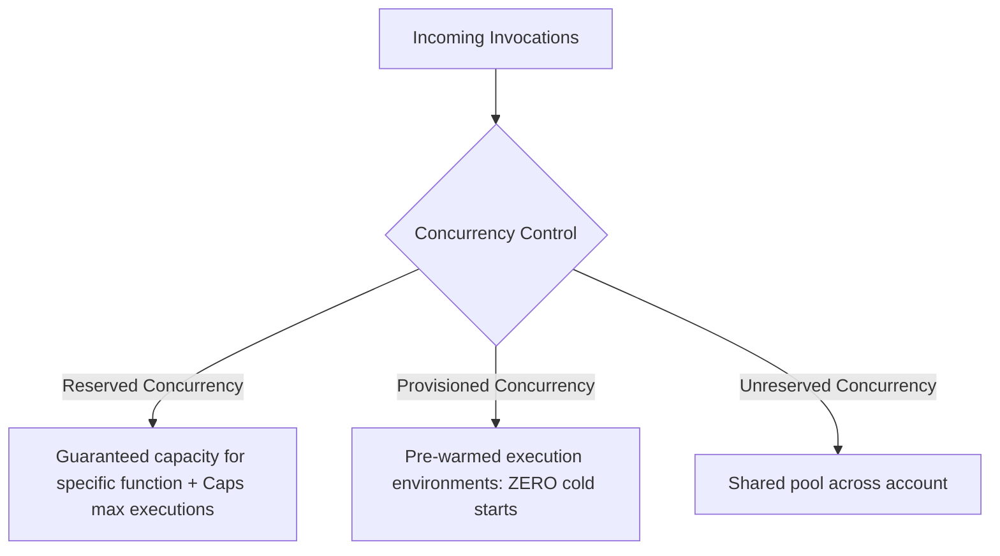
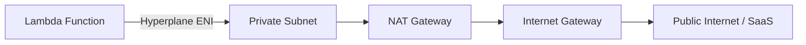

---
tags:
  - aws/service
  - aws/compute
  - aws/serverless
domain: Compute
status: evergreen
exam_priority: ⭐⭐⭐⭐⭐
---

# AWS Lambda

> [!abstract] Overview
> AWS Lambda is a serverless, event-driven compute service that lets you run code without provisioning or managing servers. You pay only for compute time consumed (measured in milliseconds).

---

## ⚙️ Lambda Specifications & Limits

| Parameter | Limit | Architectural Implication |
| :--- | :--- | :--- |
| **Max Execution Time** | **15 minutes (900 seconds)** | For tasks longer than 15 mins, use **ECS / Fargate / AWS Batch / Step Functions**. |
| **Memory Allocation** | **128 MB to 10,240 MB (10 GB)** | CPU cores scale proportionally with memory (1,769 MB = 1 full vCPU). |
| **Ephemeral Storage (`/tmp`)** | **512 MB up to 10,240 MB (10 GB)** | Local scratch disk; wiped when execution context is destroyed. |
| **Deployment Package Size** | 50 MB (zipped direct), 250 MB (unzipped), 10 GB (Container Image) | Package large dependencies into **Lambda Layers** or **Container Images**. |
| **Default Concurrency** | **1,000 concurrent executions per Region** | Can request soft limit increase. |

---

## 🔄 Concurrency & Scaling Modes

1. **Reserved Concurrency**:
   - Guarantees a dedicated slice of concurrency for a critical function.
   - Acts as a **throttle limiter** to prevent a function from overwhelming downstream resources (e.g., relational databases like RDS).
2. **Provisioned Concurrency**:
   - Keeps execution environments initialized and hyper-ready to respond in double-digit milliseconds.
   - Eliminates **Cold Start** latency for latency-sensitive applications.
3. **Lambda SnapStart**:
   - Specifically for Java runtimes; takes a Firecracker snapshot of initialized state to reduce cold starts by up to 90%.

---

## 🌐 Lambda in a VPC

- By default, Lambda runs in a secure AWS-managed VPC with direct internet access (cannot access private VPC resources).
- To access resources in a private VPC (e.g., RDS, ElastiCache, internal ALBs), configure Lambda with **VPC Subnets & Security Groups**.
- **Important**: VPC-enabled Lambda functions do **NOT** have public IPs. To access the public internet from inside a VPC, traffic must route through a **NAT Gateway** in a public subnet.

---

## ⚡ High-Yield Exam Tips

> [!tip] Exam Triggers
> - **"Run short background jobs without server management"** $\rightarrow$ **AWS Lambda**.
> - **"Lambda is overwhelming RDS PostgreSQL with too many database connections"** $\rightarrow$ Add **Amazon RDS Proxy** to pool and share connections.
> - **"Process real-time streaming data from Kinesis / DynamoDB Streams"** $\rightarrow$ Lambda Event Source Mapping with configurable batch size and tumbling/sliding windows.
> - **"Avoid cold start latency for critical user-facing API"** $\rightarrow$ Enable **Provisioned Concurrency**.

> [!warning] Exam Traps
> - Lambda execution timeout is strictly **15 minutes**. Any requirement for 30-minute ETL or 2-hour processing cannot use plain Lambda $\rightarrow$ use [[Containers (ECS, EKS, Fargate)|ECS/Fargate]] or AWS Batch.

---

## 🔗 Related Notes
- [[Containers (ECS, EKS, Fargate)]]
- [[Amazon RDS & Aurora]]
- [[Amazon SQS (Standard, FIFO, DLQ)]]
- [[AWS Step Functions]]
