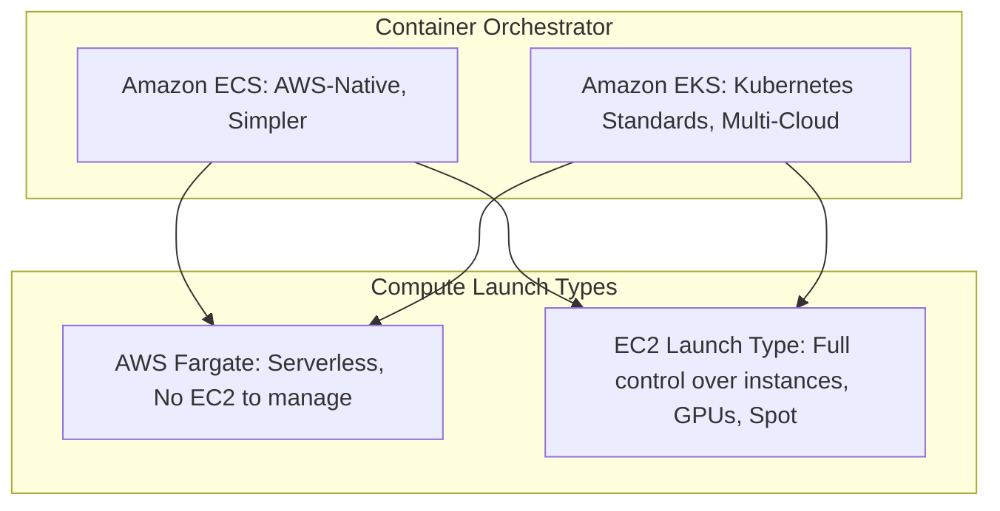

---
tags:
  - aws/service
  - aws/compute
  - aws/containers
domain: Compute
status: evergreen
exam_priority: ⭐⭐⭐⭐⭐
---

# Containers (ECS, EKS, Fargate)

> [!abstract] Overview
> AWS provides managed container orchestration through **Amazon ECS** (AWS-native) and **Amazon EKS** (Kubernetes-native), powered by either **EC2 instances** (customer-managed nodes) or **AWS Fargate** (serverless container compute).

---

## 🏗️ ECS vs EKS vs Fargate Architecture

### Launch Type Comparison

| Feature | AWS Fargate | EC2 Launch Type |
| :--- | :--- | :--- |
| **Server Management** | **None (Serverless)** | OS patching, AMI updates, instance sizing |
| **Scaling** | Per-pod / Per-task scaling | Must scale both EC2 instances and container tasks |
| **Pricing** | Pay for vCPU and Memory requested per task | Pay for underlying EC2 instances whether full or empty |
| **Storage Options** | Ephemeral storage, [[Amazon EFS & FSx|Amazon EFS]] | EBS, Instance Store, EFS |
| **Best For** | Standard microservices, variable workloads, low ops | High-performance, GPU, custom networking, strict compliance |

---

## 📦 Core ECS Concepts
1. **Task Definition**: JSON blueprint defining container images, CPU/RAM, port mappings, environment variables, IAM Task Role, and IAM Task Execution Role.
   - **Task Execution Role**: Used by ECS agent to pull image from ECR and write logs to CloudWatch.
   - **Task Role**: Used by the application inside the container to access AWS services (e.g., S3, DynamoDB).
2. **ECS Service**: Maintains specified number of running task instances across AZs; integrates with ALB target groups.
3. **ECS Task Placement Strategies** (EC2 launch type only):
   - `binpack`: Minimizes number of EC2 instances to save cost (packs tasks based on memory/CPU).
   - `spread`: Places tasks evenly across AZs or instances for high availability.
   - `random`: Random placement.

---

## ⚡ High-Yield Exam Tips

> [!tip] Exam Triggers
> - **"Run containers without managing EC2 instances or cluster capacity"** $\rightarrow$ **AWS Fargate**.
> - **"Migrate existing Kubernetes applications to AWS with minimal changes"** $\rightarrow$ **Amazon EKS**.
> - **"Grant containerized application permission to read from S3"** $\rightarrow$ Assign IAM policy to **ECS Task Role** (NOT EC2 Instance Profile).
> - **"Persistent shared storage for multiple ECS/EKS containers across AZs"** $\rightarrow$ Mount **Amazon EFS**.

---

## 🔗 Related Notes
- [[EC2 - Elastic Compute Cloud]]
- [[AWS Lambda]]
- [[Amazon EFS & FSx]]
- [[AWS IAM (Policies, Roles, Delegation)]]
