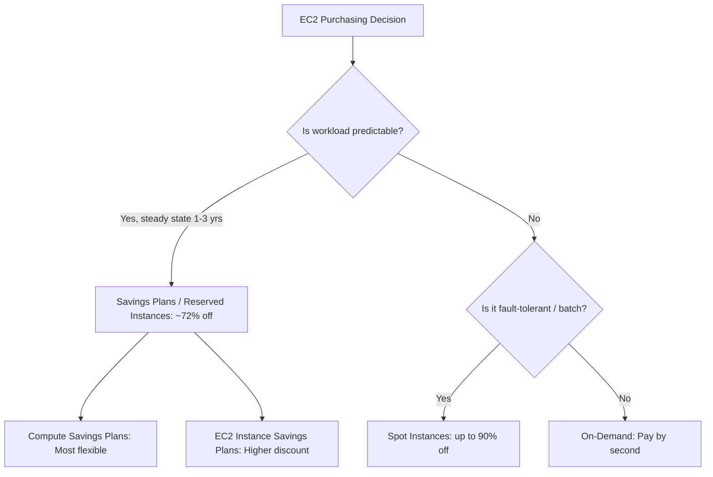
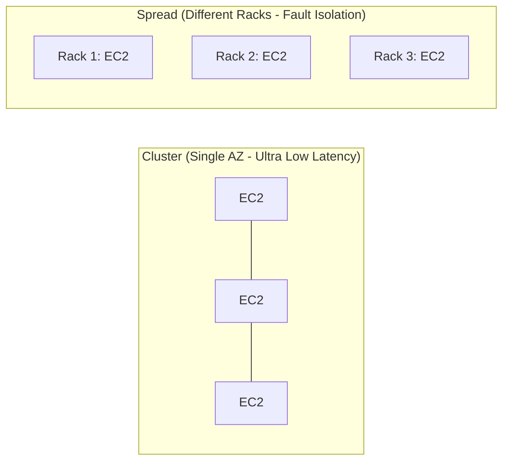

---
tags:
  - aws/service
  - aws/compute
domain: Compute
status: evergreen
exam_priority: ⭐⭐⭐⭐⭐
---

# EC2 - Elastic Compute Cloud

> [!abstract] Overview
> Amazon EC2 provides scalable, resizable virtual servers (instances) in the cloud. It offers complete control over the guest operating system, networking, and security configurations.

---

## 🏷️ Instance Types Naming Convention

Format: `m5zn.2xlarge`
- **m**: Instance Family (*General Purpose*)
- **5**: Generation (*5th gen*)
- **z**: Extra capabilities (*High CPU frequency*)
- **n**: Extra networking (*High network bandwidth*)
- **2xlarge**: Size (*determines vCPUs, RAM, EBS bandwidth*)

### Instance Families Mnemonic: **R - I - C - G - T - M**
- **R (Memory Optimized)**: High RAM-to-CPU ratio. Databases (Redis, RDS), in-memory caches.
- **C (Compute Optimized)**: High compute power. Batch processing, media transcoding, gaming, HPC.
- **M (General Purpose)**: Balanced compute, memory, and networking. Web servers, small DBs.
- **I / D / H (Storage Optimized)**: High sequential IOPS or large NVMe storage. Data warehousing, Elasticsearch, Kafka.
- **G / P (Accelerated Computing)**: GPU-based. Machine learning, 3D graphics rendering.
- **T (Burstable)**: Baseline performance with CPU credits (T3, T4g). Dev/test environments, low-traffic web servers.

---

## 💳 EC2 Purchasing Models & Strategy

1. **On-Demand**: Short-term, unpredictable workloads without commitment. Highest hourly cost.
2. **Spot Instances**: Spare EC2 capacity with up to 90% discount. AWS can reclaim with a **2-minute notice**. Ideal for stateless batch processing, CI/CD, image rendering.
3. **Reserved Instances (RIs)**: 1 or 3-year commitment for predictable workloads.
   - *Standard RI*: Up to 72% discount; cannot change instance family.
   - *Convertible RI*: Up to 54% discount; allows changing instance family, OS, and tenancy.
4. **Savings Plans**: Commitment to a consistent amount of usage ($/hour).
   - *Compute Savings Plan*: Applies automatically to EC2, Fargate, and Lambda across regions.
5. **Dedicated Hosts**: Physical EC2 server dedicated for your use. Required for **server-bound software licenses (BYOL - Bring Your Own License)** and strict compliance.
6. **Dedicated Instances**: Instances running on hardware dedicated to a single customer, but shared with other instances in the same account (cannot control socket/core placement).

---

## 📍 Placement Groups

| Type | Architecture | Best Use Case |
| :--- | :--- | :--- |
| **Cluster** | Instances packed close together inside a single AZ | **Low latency, high throughput** (HPC, big data) |
| **Spread** | Instances strictly placed on distinct underlying hardware (max 7 per AZ) | **High availability & critical applications** |
| **Partition** | Instances divided into logical partitions; partitions do not share hardware racks | **Distributed big data** (HDFS, Kafka, Cassandra) |

---

## ⚡ High-Yield Exam Tips

> [!tip] Exam Triggers
> - **"Bring Your Own License (BYOL) with per-core licensing compliance"** $\rightarrow$ **Dedicated Host**.
> - **"Highest network performance and lowest latency between instances"** $\rightarrow$ **Cluster Placement Group + Elastic Fabric Adapter (EFA)**.
> - **"Batch processing with lowest cost where jobs can resume if terminated"** $\rightarrow$ **Spot Fleet / Spot Instances**.
> - **"Prevent instance termination when user shuts down OS"** $\rightarrow$ Enable **Termination Protection** and **Stop Protection**.

> [!warning] Exam Pitfalls
> - **Cluster Placement Groups cannot span multiple AZs** (they are bound to a single AZ).
> - Spot instances are **NOT** suitable for critical databases, long-running single-transaction jobs, or stateful web apps.

---

## 🔗 Related Notes
- [[EC2 Auto Scaling & Load Balancing]]
- [[Amazon EBS & Instance Store]]
- [[Cost Optimization Pillar]]
- [[SAA-C03 High-Yield Exam Cheat Sheet]]
