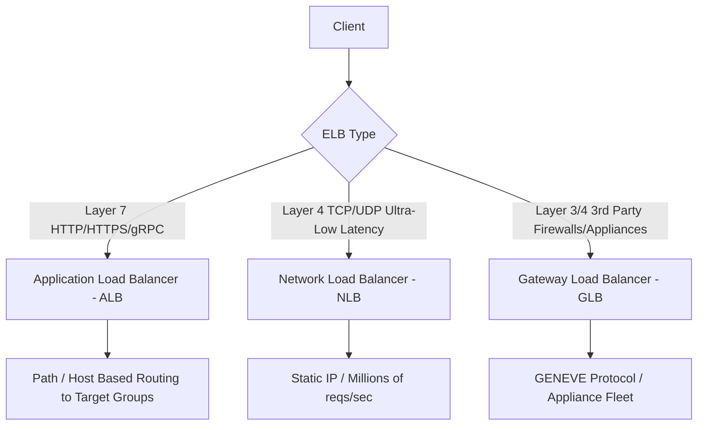
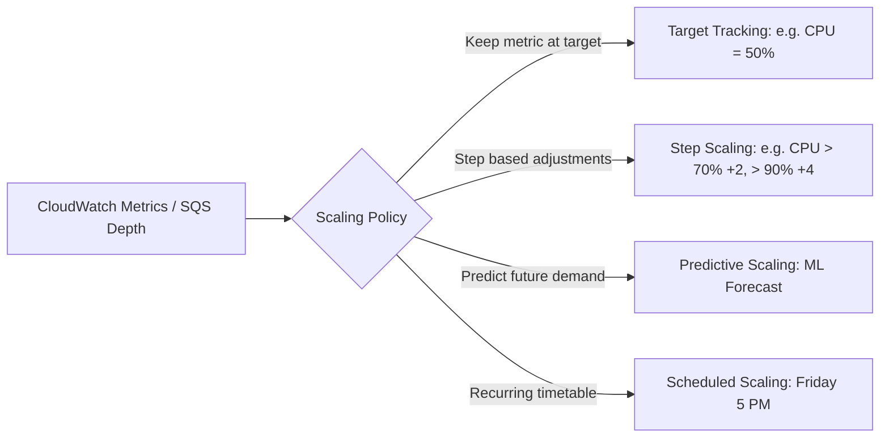

---
tags:
  - aws/service
  - aws/compute
  - aws/networking
domain: Compute
status: evergreen
exam_priority: ⭐⭐⭐⭐⭐
---

# EC2 Auto Scaling & Load Balancing

> [!abstract] Overview
> Elastic Load Balancing (ELB) distributes incoming application traffic across multiple targets (EC2 instances, containers, IP addresses, Lambda). EC2 Auto Scaling automatically adjusts the number of instances based on demand to maintain performance and optimize costs.

---

## ⚖️ Elastic Load Balancer (ELB) Types

### Deep Dive Comparison Table

| Feature | Application Load Balancer (ALB) | Network Load Balancer (NLB) | Gateway Load Balancer (GLB) |
| :--- | :--- | :--- | :--- |
| **OSI Layer** | **Layer 7** (Application) | **Layer 4** (Transport) | **Layer 3/4** (Network / Gateway) |
| **Protocols** | HTTP, HTTPS, HTTP/2, gRPC, WebSocket | TCP, UDP, TLS | IP (GENEVE encapsulation on port 6081) |
| **Static IP / Elastic IP**| No (uses dynamic DNS names) | **Yes (1 static IP per AZ)** | No |
| **Routing Features** | Path-based (`/api`, `/users`), Host-based (`app.domain.com`), Query string, Headers | IP address, port | Transparent inspection routing |
| **Performance** | High | **Ultra-high** (Millions req/s, sub-ms latency) | High |
| **Targets** | EC2, ECS, Lambda, Private IP | EC2, ECS, Private IP, ALB | 3rd-party security virtual appliances |
| **Client IP Preservation** | Uses `X-Forwarded-For` header | Native preservation in TCP packet | Preserved via GENEVE header |
| **Security Integration**| **AWS WAF directly supported** | Not directly (must integrate via ALB) | Transparent firewall appliance |

---

## 📈 Auto Scaling Group (ASG) Policies

### ASG Components
1. **Launch Template**: Recommended modern replacement for Launch Configurations. Defines AMI ID, instance type, key pair, security groups, EBS volumes, user data script, and versioning.
2. **Target Groups**: Logical group of targets monitored by health checks.
3. **Health Check Grace Period**: Time to wait (default 300s) before checking health of newly launched instances, allowing boot and warmup.
4. **Cooldown Period**: Prevents the ASG from launching or terminating additional instances before previous scaling activities take effect.

---

## ⚡ High-Yield Exam Tips

> [!tip] Exam Keyword Mappings
> - **"Extreme performance, millions of requests per second, ultra-low latency, or needs a static IP"** $\rightarrow$ **NLB**.
> - **"Microservices routing based on URL path (`/orders`, `/cart`) or host header"** $\rightarrow$ **ALB**.
> - **"Scale EC2 instances based on SQS queue depth"** $\rightarrow$ Custom CloudWatch metric `ApproximateNumberOfMessagesVisible / Number of EC2 instances` + **Target Tracking Scaling Policy**.
> - **"Scale ahead of predictable traffic spikes (e.g., Black Friday)"** $\rightarrow$ **Scheduled Scaling** or **Predictive Scaling**.

> [!warning] Exam Traps
> - Security Groups can be attached to **ALB**, but **NLB does not evaluate security groups directly** (traffic passes directly to target security group, unless NLB Security Group feature is explicitly enabled).
> - ALB terminates TCP connection; client IP is seen via `X-Forwarded-For` and `X-Forwarded-Proto`.

---

## 🔗 Related Notes
- [[EC2 - Elastic Compute Cloud]]
- [[Network Security (Security Groups, NACLs, WAF, Shield)]]
- [[Reliability Pillar]]
- [[Amazon SQS (Standard, FIFO, DLQ)]]
