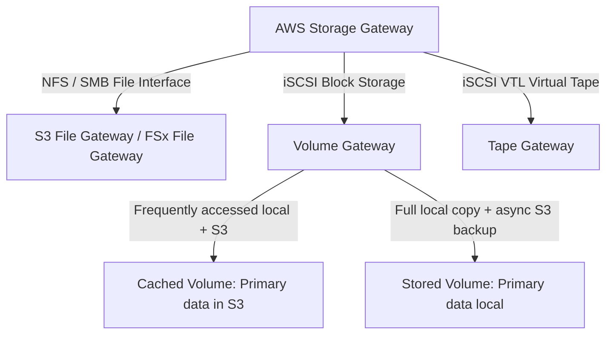

---
tags:
  - aws/service
  - aws/storage
  - aws/hybrid
  - aws/migration
domain: Storage
status: evergreen
exam_priority: ⭐⭐⭐⭐
---

# AWS Storage Gateway & DataSync

> [!abstract] Overview
> AWS hybrid storage and data migration services enable on-premises environments to seamlessly connect with, backup to, and transfer data into AWS cloud storage.

---

## 🚪 AWS Storage Gateway Types



### Storage Gateway Comparison Matrix

| Gateway Type | Protocol Presented | Local Storage Model | Cloud Storage Backend | Ideal Scenario |
| :--- | :--- | :--- | :--- | :--- |
| **S3 File Gateway** | NFS, SMB | Local cache of active files | Amazon S3 (objects) | On-prem file sharing, direct S3 data pipelines |
| **FSx File Gateway** | SMB | Local cache of Windows files | FSx for Windows | Low-latency on-prem access to AWS FSx file shares |
| **Volume Gateway (Cached)**| iSCSI block | Local cache of hot data | Amazon S3 (cost-effective) | On-prem storage expansion without buying more disks |
| **Volume Gateway (Stored)**| iSCSI block | Entire dataset stored locally | S3 Snapshots (async backup) | Low-latency local access with cloud DR backups |
| **Tape Gateway** | iSCSI VTL | Local tape buffer | S3 and Glacier Flexible / Deep Archive | Replacing physical tape libraries with cloud virtual tapes |

---

## ⚡ AWS DataSync vs Storage Gateway vs Snow Family

```mermaid
graph LR
    Need[Data Migration Need] --> Type{Transfer Mechanism}
    Type -->|Continuous hybrid access & caching| SG[[AWS Storage Gateway & DataSync|Storage Gateway]]
    Type -->|Automated online network sync up to 10 Gbps| DS[AWS DataSync: Agent-based replication]
    Type -->|Offline petabyte-scale physical transfer| Snow[AWS Snow Family: Snowcone, Snowball, Snowmobile]
```

### 1. AWS DataSync
- Agent-based, accelerated online data transfer tool.
- Automatically transfers and synchronizes data between on-premises storage (NFS, SMB, HDFS, Object) and AWS (S3, EFS, FSx).
- Performs automated data integrity verification in transit and at rest.

### 2. AWS Snow Family (Offline Data Transfer)
- **Snowcone**: 8 TB usable storage; portable, edge computing (AWS IoT Greengrass).
- **Snowball Edge Storage Optimized**: 80 TB or 210 TB NVMe; data transfer & EC2 compute.
- **Snowball Edge Compute Optimized**: 104 vCPUs, GPU support; edge machine learning and ruggedized compute.
- **Snowmobile**: Semi-trailer truck transporting up to **100 PB** for massive datacenter migrations.

---

## ⚡ High-Yield Exam Tips

> [!tip] Exam Triggers
> - **"Replace physical tape backup infrastructure without modifying existing backup software"** $\rightarrow$ **Tape Gateway**.
> - **"Migrate 50 TB of data to S3 over a limited 10 Mbps internet connection in less than 2 weeks"** $\rightarrow$ **AWS Snowball Edge** (Network transfer would take months).
> - **"Automated scheduled synchronization between on-prem NFS and Amazon EFS with data validation"** $\rightarrow$ **AWS DataSync**.
> - **"On-prem users need low-latency SMB access to files backed by S3"** $\rightarrow$ **S3 File Gateway**.

---

## 🔗 Related Notes
- [[Amazon S3 Deep Dive]]
- [[Amazon EFS & FSx]]
- [[Decision Matrix - Storage Services]]
- [[Decision Matrix - Hybrid Connectivity]]
