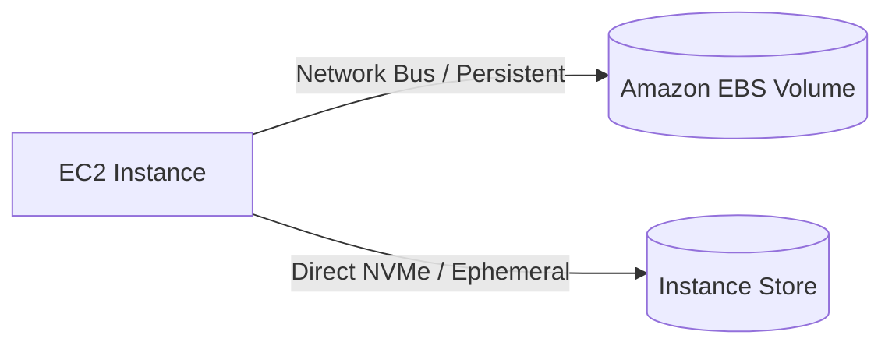

---
tags:
  - aws/service
  - aws/storage
  - aws/compute
domain: Storage
status: evergreen
exam_priority: ⭐⭐⭐⭐⭐
---

# Amazon EBS & Instance Store

> [!abstract] Overview
> Amazon Elastic Block Store (Amazon EBS) provides persistent, high-performance block-level storage volumes for Amazon EC2. Amazon EC2 Instance Store provides temporary, ultra-fast block storage directly attached to the physical host.

---

## 🥊 EBS vs Instance Store

| Feature | Amazon EBS | EC2 Instance Store |
| :--- | :--- | :--- |
| **Physical Location** | Network-attached drive | Physically attached to the host server |
| **Persistence** | **Persistent** (survives EC2 Stop/Start/Reboot) | **Ephemeral** (data LOST on Stop or Terminate) |
| **Snapshots** | Native point-in-time snapshots to S3 | Must copy data manually to S3/EBS |
| **Performance** | High (up to 256,000 IOPS on io2 Block Express)| **Ultra-high IOPS & lowest sub-ms latency** |
| **Root Volume Support**| Yes | Only supported on select instance types |
| **Best For** | Databases, boot volumes, persistent files | Caches, scratch disks, temporary buffers, big data HDFS |

---

## 📊 EBS Volume Types & Specifications

| Category | Volume Type | Base Throughput / IOPS | Max IOPS | Max Throughput | Best Use Case |
| :--- | :--- | :--- | :--- | :--- | :--- |
| **SSD (General Purpose)** | **gp3** *(Recommended)* | Baseline 3,000 IOPS & 125 MB/s | **16,000 IOPS** | **1,000 MB/s** | Boot volumes, dev/test, standard web apps |
| **SSD (General Purpose)** | **gp2** *(Legacy)* | Scales with volume size (3 IOPS/GB) | 16,000 IOPS | 250 MB/s | Legacy default (use gp3 instead for 20% savings) |
| **SSD (Provisioned IOPS)**| **io2 Block Express** | 1,000 IOPS/GB | **256,000 IOPS** | **4,000 MB/s** | Mission-critical Oracle, SAP HANA, SQL Server |
| **SSD (Provisioned IOPS)**| **io1** | 50 IOPS/GB | 64,000 IOPS | 1,000 MB/s | High-performance I/O intensive databases |
| **HDD (Throughput Tuned)**| **st1** | Throughput-focused (cannot boot) | 500 IOPS | 500 MB/s | Big data, MapReduce, Kafka, log processing |
| **HDD (Cold)** | **sc1** | Lowest cost block storage | 250 IOPS | 250 MB/s | Infrequently accessed sequential data |

---

## 📸 EBS Snapshots & Features

1. **Incremental Snapshots**: Snapshots capture only changed blocks since the previous snapshot, stored redundantly in S3.
2. **EBS Multi-Attach**: Allows a single **io1/io2** volume to be attached concurrently to up to 16 Linux EC2 instances in the same AZ (requires cluster-aware file system like GFS2).
3. **Fast Snapshot Restore (FSR)**: Eliminates snapshot initial I/O latency penalty when restoring volumes.
4. **EBS Encryption**: Encrypts data at rest, data in transit between EC2 and EBS, snapshots, and volumes created from snapshots using AWS KMS.

---

## ⚡ High-Yield Exam Tips

> [!tip] Exam Triggers
> - **"Temporary high-performance scratch disk for video encoding or caching"** $\rightarrow$ **Instance Store**.
> - **"Critical database needing over 64,000 IOPS and sub-millisecond latency"** $\rightarrow$ **io2 Block Express**.
> - **"Cost-effective storage for high-throughput big data log streams"** $\rightarrow$ **Throughput Optimized HDD (st1)**.
> - **"Share a block volume across multiple EC2 instances simultaneously"** $\rightarrow$ **EBS Multi-Attach on io1/io2**.

> [!warning] Exam Pitfalls
> - HDD volumes (**st1** and **sc1**) **CANNOT** be used as EC2 boot/root volumes.
> - EBS volumes are **AZ-locked**. To move an EBS volume to another AZ or Region: Take Snapshot $\rightarrow$ (Copy Snapshot to Region) $\rightarrow$ Create Volume from Snapshot in target AZ.

---

## 🔗 Related Notes
- [[EC2 - Elastic Compute Cloud]]
- [[Amazon EFS & FSx]]
- [[Decision Matrix - Storage Services]]
- [[Cost Optimization Pillar]]
