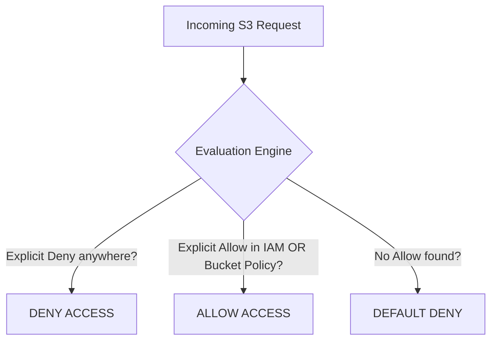
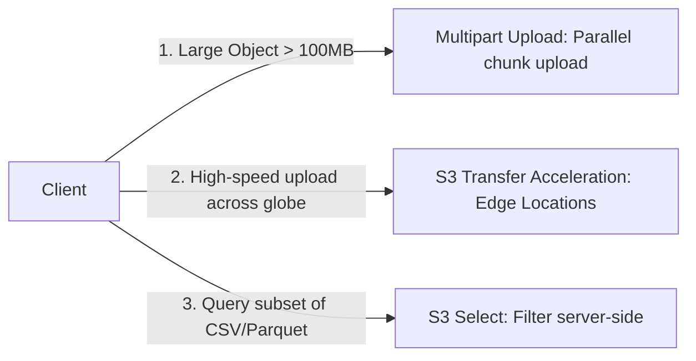

---
tags:
  - aws/service
  - aws/storage
  - aws/s3
domain: Storage
status: evergreen
exam_priority: ⭐⭐⭐⭐⭐
---

# Amazon S3 Deep Dive

> [!abstract] Overview
> Amazon Simple Storage Service (Amazon S3) is an industry-leading object storage service offering 99.999999999% (11 9s) of data durability, virtually unlimited scale, comprehensive security, and fine-grained access control.

---

## 🔐 S3 Security & Access Control

### Access Control Mechanisms
1. **Bucket Policies**: JSON resource policies attached to the bucket. Used to:
   - Enforce HTTPS (TLS) connections via `aws:SecureTransport`.
   - Require SSE-KMS / SSE-S3 encryption on `s3:PutObject`.
   - Grant cross-account access without IAM roles.
2. **IAM Policies**: User-centric policies granting IAM principals access to S3 actions.
3. **Block Public Access**: Account-level and bucket-level master switches that override all policies to prevent accidental public data leakage.
4. **S3 Access Points**: Dedicated hostnames with unique access policies tailored for specific teams or applications.
5. **S3 Object Lock (WORM - Write Once Read Many)**:
   - **Compliance Mode**: Objects cannot be deleted or overwritten by **ANYONE** (including the AWS root account) until retention expires.
   - **Governance Mode**: Specific IAM users with `s3:BypassGovernanceRetention` can override or delete objects.
   - **Legal Hold**: Explicit flag preventing deletion until manually removed.

---

## 🔄 S3 Replication (CRR & SRR)

- **Cross-Region Replication (CRR)**: Replicates objects across different AWS regions for disaster recovery, compliance, and latency reduction.
- **Same-Region Replication (SRR)**: Replicates objects within the same region (e.g., across accounts for log aggregation or dev/prod isolation).
- **Prerequisites for Replication**:
  - **Versioning MUST be enabled** on both source and destination buckets.
  - Proper IAM replication role permissions.
- **Replication Time Control (S3 RTC)**: Backed by SLA to replicate 99.9% of objects within **15 minutes**.

---

## ⚡ Performance Optimization

1. **Multipart Upload**:
   - Recommended for objects $> 100\text{ MB}$; **mandatory for objects $> 5\text{ GB}$**.
   - Uploads parts in parallel and resumes failed chunks without restarting entire file upload.
2. **S3 Transfer Acceleration**:
   - Uses AWS CloudFront global edge locations to route uploads over the optimized AWS private network backbone.
3. **S3 Select & Glacier Select**:
   - Retrieves only a subset of data from an object using simple SQL expressions (reduces data transfer and latency up to 80%).
4. **Request Rate Scaling**:
   - Scales automatically to **3,500 PUT/COPY/POST/DELETE** and **5,500 GET/HEAD** requests per second per prefix. Use unique prefixes to scale horizontally.

---

## ⚡ High-Yield Exam Tips

> [!tip] Exam Triggers
> - **"Strict regulatory compliance where NO ONE, not even the root user, can delete data for 7 years"** $\rightarrow$ **S3 Object Lock in Compliance Mode**.
> - **"Upload files larger than 5 GB"** $\rightarrow$ **S3 Multipart Upload**.
> - **"Speed up global uploads from clients worldwide to a single S3 bucket"** $\rightarrow$ **S3 Transfer Acceleration**.
> - **"Enforce encryption in transit"** $\rightarrow$ Bucket policy with `"Condition": {"Bool": {"aws:SecureTransport": "false"}}` $\rightarrow$ `Deny`.

---

## 🔗 Related Notes
- [[S3 Storage Classes & Lifecycle]]
- [[Decision Matrix - Storage Services]]
- [[KMS & Secrets Manager]]
- [[Cost Optimization Pillar]]
