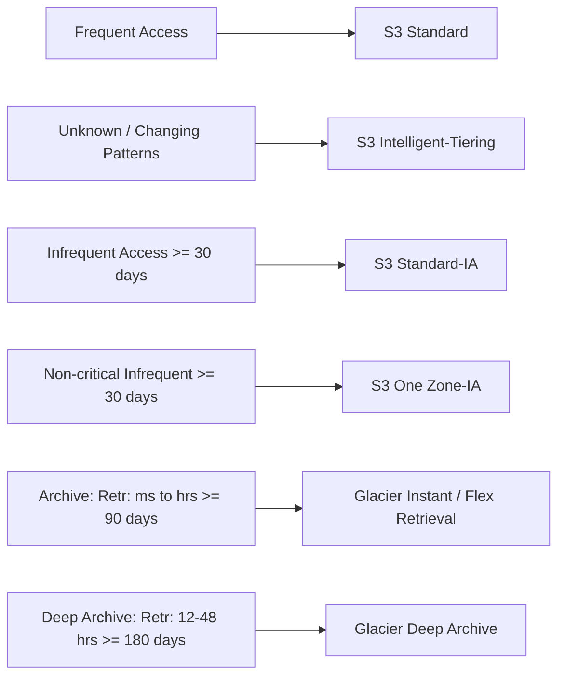
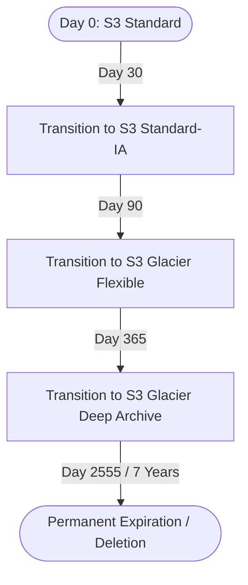

---
tags:
  - aws/service
  - aws/storage
  - aws/cost
domain: Storage
status: evergreen
exam_priority: ⭐⭐⭐⭐⭐
---

# S3 Storage Classes & Lifecycle

> [!abstract] Overview
> Amazon S3 offers a range of storage classes designed for different data access patterns, retention requirements, and cost profiles. Automated S3 Lifecycle policies optimize costs throughout an object's life cycle.

---

## 🗄️ S3 Storage Class Comparison

### Detailed Class Matrix

| Storage Class | Availability | Durability | Min Storage Duration | Retrieval Time | Retrieval Fee? | Best Use Case |
| :--- | :--- | :--- | :--- | :--- | :--- | :--- |
| **S3 Standard** | 99.99% | 11 9s | None | Milliseconds | No | Active, frequently accessed data, websites |
| **S3 Intelligent-Tiering** | 99.9% | 11 9s | None (monthly monitoring fee) | Milliseconds | **No** | Workloads with unknown or changing access |
| **S3 Standard-IA** | 99.9% | 11 9s | **30 days** | Milliseconds | Yes | Long-term backups, DR data accessed occasionally |
| **S3 One Zone-IA** | 99.5% | 11 9s (1 AZ) | **30 days** | Milliseconds | Yes | Secondary backup copies, easily recreatable data |
| **S3 Glacier Instant** | 99.9% | 11 9s | **90 days** | **Milliseconds** | Yes | Medical images, news archives accessed quarterly |
| **S3 Glacier Flexible**| 99.99% | 11 9s | **90 days** | Expedited: 1-5m Std: 3-5h Bulk: 5-12h | Yes | Compliance archives, backups where hours are OK |
| **S3 Glacier Deep Archive**| 99.99% | 11 9s | **180 days** | Std: 12h Bulk: 48h | Yes | Lowest cost storage ($1/TB/month) for 7-10yr retention |
| **S3 Express One Zone**| 99.95% | 11 9s (1 AZ) | None | **Single-digit ms** | No | AI/ML training, analytics requiring lowest latency |

---

## ⏳ S3 Lifecycle Configuration Rules

### Lifecycle Actions
1. **Transition Actions**: Moves objects to cheaper storage tiers as they age.
2. **Expiration Actions**: Deletes expired current versions, cleans up noncurrent object versions, or permanently deletes expired delete markers.
3. **Abort Incomplete Multipart Uploads**: Critical cost rule to delete unfinished multipart upload byte fragments after X days.

---

## ⚡ High-Yield Exam Tips

> [!tip] Exam Triggers
> - **"Lowest cost storage for compliance audit logs retained for 10 years, retrieval time of 12-24 hours is acceptable"** $\rightarrow$ **S3 Glacier Deep Archive**.
> - **"Archived data requiring immediate / millisecond access when requested"** $\rightarrow$ **S3 Glacier Instant Retrieval**.
> - **"Optimize S3 storage costs automatically with unknown or unpredictable access patterns with zero operational effort"** $\rightarrow$ **S3 Intelligent-Tiering**.
> - **"Cost-effective storage for reproducible thumbnail images"** $\rightarrow$ **S3 One Zone-IA**.

> [!warning] Exam Traps
> - Do not transition objects smaller than 128 KB or objects stored for less than 30 days to Standard-IA / Glacier (minimum billable size is 128 KB and early deletion fees apply).

---

## 🔗 Related Notes
- [[Amazon S3 Deep Dive]]
- [[Decision Matrix - Storage Services]]
- [[Cost Optimization Pillar]]
