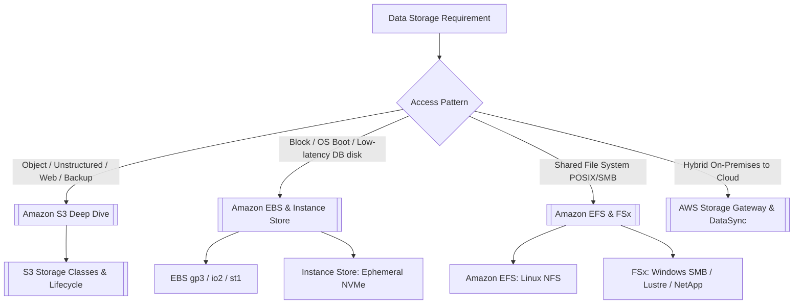

---
tags:
  - aws/moc
  - aws/storage
status: evergreen
---

# 🗄️ Storage Map of Content

> [!abstract] Overview
> AWS provides a broad spectrum of storage solutions categorized into Object Storage (S3), Block Storage (EBS, Instance Store), File Storage (EFS, FSx), and Hybrid Data Migration tools (Storage Gateway, DataSync, Snow Family).

---

## 🧭 AWS Storage Decision Tree

---

## 📂 Storage Notes Directory

1. **[[Amazon S3 Deep Dive]]**:
   - Bucket policies, Versioning, Object Lock, Replication (CRR/SRR), Multi-part Upload, Access Points.
2. **[[S3 Storage Classes & Lifecycle]]**:
   - Standard, Intelligent-Tiering, Standard-IA, One Zone-IA, Glacier Instant/Flexible/Deep Archive, Lifecycle transitions.
3. **[[Amazon EBS & Instance Store]]**:
   - EBS volume types (gp3, gp2, io2 Block Express, st1, sc1), Snapshots, Multi-Attach, Instance Store vs EBS.
4. **[[Amazon EFS & FSx]]**:
   - EFS (NFSv4 Linux), FSx for Windows File Server, FSx for Lustre (HPC), FSx for NetApp ONTAP.
5. **[[AWS Storage Gateway & DataSync]]**:
   - S3 File Gateway, Volume Gateway (Stored vs Cached), Tape Gateway, DataSync, Snow Family devices.

---

## 📊 High-Level Storage Comparison

| Storage Service | Type | Protocol | Multi-Instance Access | Persistence | Durability SLA |
| :--- | :--- | :--- | :--- | :--- | :--- |
| **[[Amazon S3 Deep Dive|Amazon S3]]** | Object | HTTPS / REST | Unlimited global access | Persistent | **99.999999999% (11 9s)** |
| **[[Amazon EBS & Instance Store|Amazon EBS]]** | Block | Direct attachment | 1 EC2 (Multi-Attach io1/io2 only) | Persistent (AZ-bound) | 99.8% - 99.999% |
| **[[Amazon EBS & Instance Store|Instance Store]]**| Block | Direct NVMe bus | 1 EC2 instance | **Ephemeral (lost on stop)**| N/A |
| **[[Amazon EFS & FSx|Amazon EFS]]** | File | NFSv4 (POSIX) | Thousands of Linux EC2/ECS | Persistent (Multi-AZ) | **99.999999999% (11 9s)** |
| **[[Amazon EFS & FSx|FSx for Windows]]**| File | SMB / CIFS | Windows & Linux clients | Persistent (Multi-AZ) | High |
| **[[Amazon EFS & FSx|FSx for Lustre]]** | File | Lustre (POSIX) | Thousands of HPC compute nodes | Persistent / Scratch | High |

---

## 🔗 Related Notes
- [[00 - Home|Master Index]]
- [[Decision Matrix - Storage Services]]
- [[Cost Optimization Pillar]]
