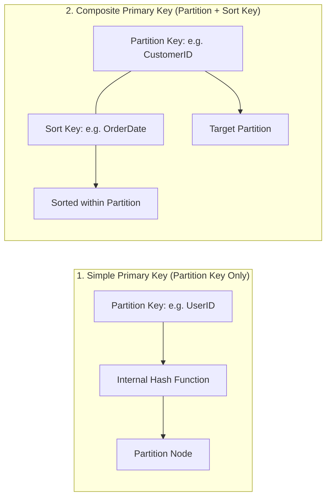
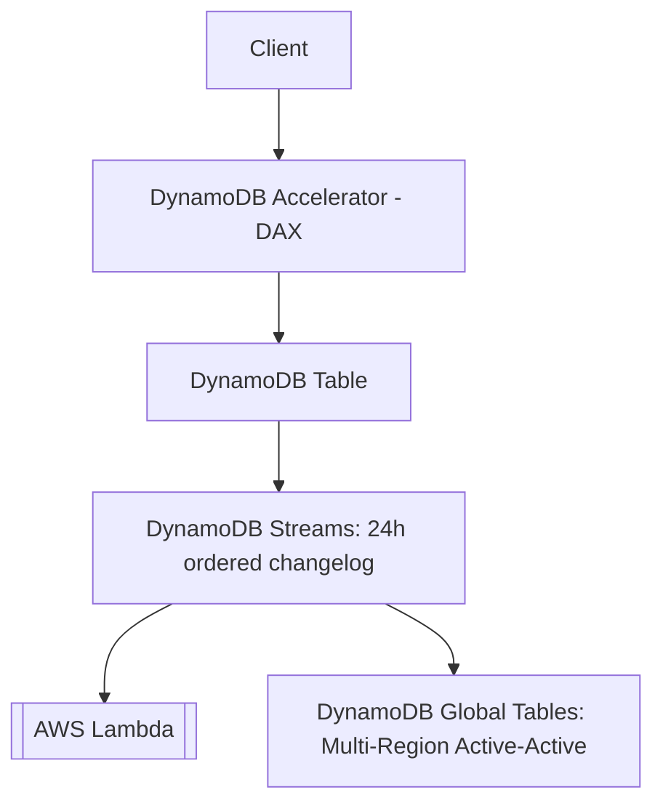

---
tags:
  - aws/service
  - aws/database
  - aws/nosql
  - aws/serverless
domain: Database
status: evergreen
exam_priority: ⭐⭐⭐⭐⭐
---

# Amazon DynamoDB

> [!abstract] Overview
> Amazon DynamoDB is a fully managed, serverless, key-value and document NoSQL database designed for single-digit millisecond latency at any scale. It offers built-in security, continuous backups, automated multi-Region replication, and in-memory caching.

---

## 🔑 Primary Key Architecture

---

## 📊 Secondary Indexes: GSI vs LSI

| Feature | Global Secondary Index (GSI) | Local Secondary Index (LSI) |
| :--- | :--- | :--- |
| **Partition Key** | **Can be different** from table Partition Key | **Must be SAME** as table Partition Key |
| **Sort Key** | Can be different or optional | **Must be different** from table Sort Key |
| **Creation Time** | Created at table creation or **added dynamically anytime** | **ONLY at table creation time** (cannot add later) |
| **Capacity / RCU & WCU**| **Independent** provisioned RCU/WCU (or on-demand) | Uses the **main table's** RCU/WCU |
| **Consistency** | **Eventual Consistency only** | Strongly Consistent or Eventually Consistent |
| **Max Limit** | 20 GSIs per table | 5 LSIs per table |

---

## 🧮 Read & Write Capacity Units (RCU & WCU)

- **1 WCU** = 1 write per second for an item up to **1 KB**.
- **1 RCU** = 1 strongly consistent read per second (or 2 eventually consistent reads per second) for an item up to **4 KB**.
- **Transactional Reads/Writes** consume double the capacity (2 WCUs per 1 KB, 2 RCUs per 4 KB).

> [!example] Capacity Calculation Example
> - Write 10 items/sec of size 2.5 KB $\rightarrow$ Round up to 3 KB $\rightarrow$ $10 \times 3 = 30\text{ WCUs}$.
> - Read 10 items/sec of size 6 KB with Strongly Consistent Reads $\rightarrow$ Round up to 8 KB ($2 \times 4\text{ KB}$) $\rightarrow$ $10 \times 2 = 20\text{ RCUs}$.
> - Read 10 items/sec of size 6 KB with Eventually Consistent Reads $\rightarrow$ $20 / 2 = 10\text{ RCUs}$.

---

## ⚡ DynamoDB Advanced Features

1. **DynamoDB Accelerator (DAX)**:
   - In-memory write-through cache cluster dedicated for DynamoDB.
   - Reduces read response times from milliseconds to **microseconds**.
   - Requires no application rewrite (SDK compatible).
2. **DynamoDB Streams**:
   - 24-hour time-ordered sequence of item-level modifications (INSERT, MODIFY, REMOVE).
   - Used to trigger [[AWS Lambda]], update search indexes (OpenSearch), or synchronize with [[Amazon SQS (Standard, FIFO, DLQ)]].
3. **Global Tables**:
   - Multi-region, multi-master active-active replication based on DynamoDB Streams.
   - Provides local read/write performance for globally distributed applications with 99.999% availability.
4. **Time to Live (TTL)**:
   - Automatically deletes expired items without consuming write capacity units.

---

## ⚡ High-Yield Exam Tips

> [!tip] Exam Triggers
> - **"Need microsecond read latency for high-traffic DynamoDB workloads"** $\rightarrow$ **Amazon DynamoDB Accelerator (DAX)**.
> - **"Multi-Region active-active NoSQL database with local read/write performance"** $\rightarrow$ **DynamoDB Global Tables**.
> - **"Trigger real-time processing or downstream actions when database records change"** $\rightarrow$ **DynamoDB Streams + AWS Lambda**.
> - **"Delete session tokens or cart items automatically after 7 days without code or cost"** $\rightarrow$ **DynamoDB TTL**.

---

## 🔗 Related Notes
- [[Amazon RDS & Aurora]]
- [[ElastiCache & MemoryDB]]
- [[Decision Matrix - Database Selection]]
- [[AWS Lambda]]
