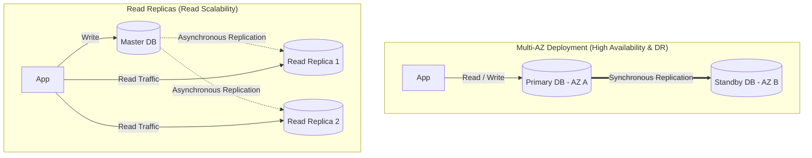
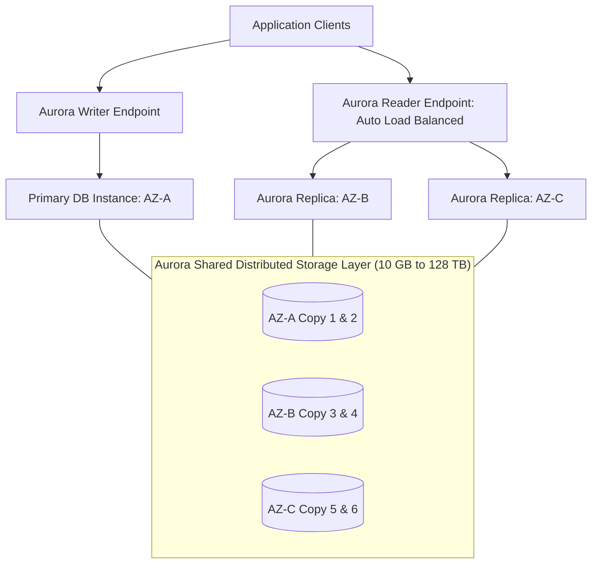

---
tags:
  - aws/service
  - aws/database
  - aws/relational
domain: Database
status: evergreen
exam_priority: ⭐⭐⭐⭐⭐
---

# Amazon RDS & Aurora

> [!abstract] Overview
> Amazon Relational Database Service (Amazon RDS) makes it easy to set up, operate, and scale relational databases in the cloud. Amazon Aurora is AWS's proprietary MySQL and PostgreSQL-compatible cloud-native relational engine.

---

## ⚖️ RDS Multi-AZ vs Read Replicas

### Direct Feature Comparison

| Dimension | Multi-AZ (HA) | Read Replicas (Scaling) |
| :--- | :--- | :--- |
| **Primary Purpose** | **High Availability & Disaster Recovery** | **Read Performance & Scaling** |
| **Replication Mode** | **Synchronous** (Zero data loss) | **Asynchronous** (Eventual consistency) |
| **Active/Standby** | Standby is **inactive** (cannot accept reads) | Replicas are **active** (serve SELECT queries) |
| **Failover Behavior**| **Automatic failover** via DNS switch (60-120s) | Manual promotion to standalone DB |
| **Scope** | Same Region (Multi-AZ) | Same AZ, Cross-AZ, or **Cross-Region** |
| **Impact on Backups**| Backups taken from Standby (no I/O freeze on Primary) | N/A |

---

## 🚀 Amazon Aurora Deep Dive

### Core Aurora Architectural Advantages
1. **Shared Storage Fleet**: 6 copies of data replicated across 3 Availability Zones.
   - Write Quorum: 4 of 6 copies.
   - Read Quorum: 3 of 6 copies.
   - Self-healing storage disk blocks continuously scanned and repaired.
2. **Replication**: Up to **15 Aurora Replicas** with sub-10ms replication lag (shared storage eliminates disk write lag).
3. **Endpoints**:
   - **Writer Endpoint**: Always points to the current primary instance.
   - **Reader Endpoint**: Automatically load-balances read traffic across all available Aurora Replicas.
   - **Custom Endpoints**: Route subsets of replicas to specific workloads (e.g., analytics vs web app).
4. **Aurora Serverless v2**: Scales database capacity up or down instantly in fine-grained increments (ACUs) based on workload.
5. **Aurora Global Database**: Dedicated replication across up to 5 secondary AWS regions with **$< 1\text{ second}$ replication latency** and fast cross-region failover ($< 1\text{ minute}$).

---

## ⚡ High-Yield Exam Tips

> [!tip] Exam Triggers
> - **"Synchronous failover with zero data loss in case of AZ outage"** $\rightarrow$ **RDS Multi-AZ**.
> - **"Offload heavy read reporting queries that are slowing down the production database"** $\rightarrow$ **RDS Read Replicas**.
> - **"Relational database with unpredictable, intermittent, or bursty traffic"** $\rightarrow$ **Aurora Serverless v2**.
> - **"Cross-region disaster recovery for relational DB with RPO < 1 second and RTO < 1 minute"** $\rightarrow$ **Aurora Global Database**.
> - **"High connection churn from serverless Lambda functions causing DB exhaustion"** $\rightarrow$ **Amazon RDS Proxy**.

> [!warning] Exam Pitfalls
> - Standard RDS Read Replicas use **asynchronous** replication; promoting a replica to primary may lose uncommitted writes.
> - RDS Multi-AZ Standby cannot be used to serve read queries (unless using the newer *Multi-AZ DB Cluster with two readable standbys*).

---

## 🔗 Related Notes
- [[Amazon DynamoDB]]
- [[ElastiCache & MemoryDB]]
- [[Decision Matrix - Database Selection]]
- [[Reliability Pillar]]
