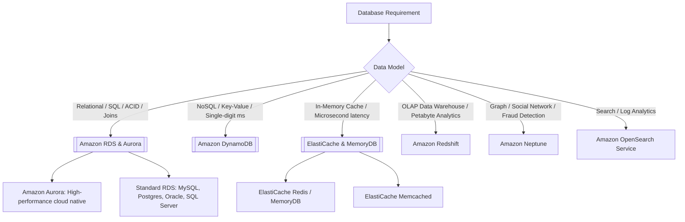

---
tags:
  - aws/moc
  - aws/databases
status: evergreen
---

# 🗄️ Databases Map of Content

> [!abstract] Overview
> AWS provides a broad spectrum of purpose-built databases optimized for relational (RDS/Aurora), key-value and document (DynamoDB/DocumentDB), in-memory (ElastiCache/MemoryDB), columnar analytics (Redshift), graph (Neptune), and time-series (Timestream) workloads.

---

## 🧭 AWS Database Decision Map

---

## 📂 Databases Notes Directory

1. **[[Amazon RDS & Aurora]]**:
   - RDS Multi-AZ vs Read Replicas, Aurora architecture (6 copies across 3 AZs), Aurora Serverless v2, Global Database.
2. **[[Amazon DynamoDB]]**:
   - Primary keys, WCU/RCU calculations, GSI vs LSI, DynamoDB Streams, DAX accelerator, Global Tables.
3. **[[ElastiCache & MemoryDB]]**:
   - Redis vs Memcached, MemoryDB for Redis (durable in-memory DB), Cache-aside vs Write-through strategies.
4. **[[Specialized Databases (Redshift, Neptune, OpenSearch)]]**:
   - Redshift (OLAP data warehouse), Neptune (Graph), OpenSearch (Full text search & logs), Timestream, DocumentDB.

---

## 📊 Database High-Yield Summary

| Database Service | Engine Type | Scaling Mechanism | Primary Access Pattern | Typical Latency |
| :--- | :--- | :--- | :--- | :--- |
| **[[Amazon RDS & Aurora|Amazon RDS]]** | Relational (SQL) | Vertical compute scaling, Read Replicas | Complex SQL, transactions, joins | Milliseconds |
| **[[Amazon RDS & Aurora|Amazon Aurora]]**| Relational (Cloud-native) | Auto-scaling storage (up to 128 TB), up to 15 replicas | High-throughput OLTP, enterprise SQL | Milliseconds (3x-5x faster) |
| **[[Amazon DynamoDB]]** | NoSQL (Key-Value/Doc) | Horizontal partitioning, auto-scaling | Known partition key lookups | **Single-digit ms** |
| **[[Amazon DynamoDB|DynamoDB + DAX]]** | In-memory cache for DDB | Managed cluster cache | Read-heavy DynamoDB queries | **Microseconds** |
| **[[ElastiCache & MemoryDB|ElastiCache]]** | In-Memory (Redis/Memcached) | Sharding & Read Replicas | Session state, caching, rankings | **Microseconds** |
| **[[Specialized Databases (Redshift, Neptune, OpenSearch)|Amazon Redshift]]** | Columnar OLAP | Leader & Compute Nodes (RA3) | Aggregations, BI queries, Data Lake | Seconds |

---

## 🔗 Related Notes
- [[00 - Home|Master Index]]
- [[Decision Matrix - Database Selection]]
- [[Performance Efficiency Pillar]]
- [[Reliability Pillar]]
