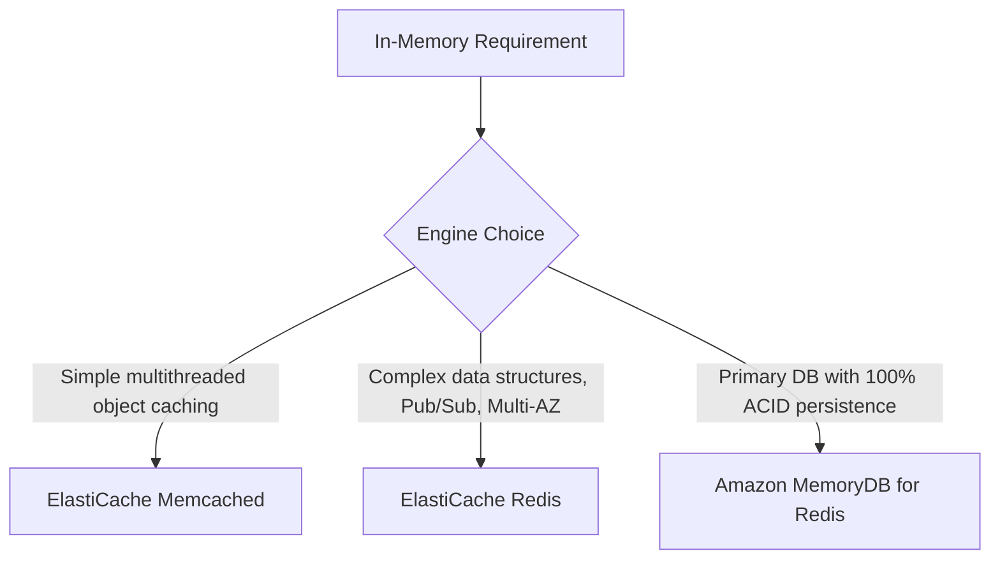
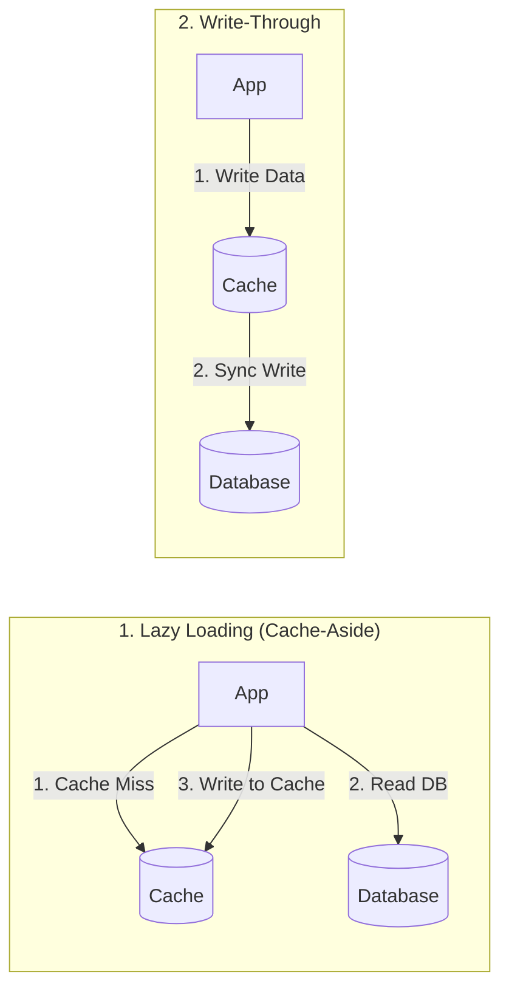

---
tags:
  - aws/service
  - aws/database
  - aws/in-memory
domain: Database
status: evergreen
exam_priority: ⭐⭐⭐⭐
---

# ElastiCache & MemoryDB

> [!abstract] Overview
> AWS in-memory caching and database engines provide microsecond response times by storing data in memory rather than on disk, offloading heavy read traffic from relational and NoSQL databases.

---

## 🥊 ElastiCache Redis vs Memcached vs MemoryDB

### Feature Comparison

| Feature | ElastiCache Redis | ElastiCache Memcached | Amazon MemoryDB for Redis |
| :--- | :--- | :--- | :--- |
| **Data Structures** | Strings, Hashes, Lists, Sets, Sorted Sets, Bitmaps | Pure Key-Value (simple strings/objects) | Full Redis data structures |
| **Architecture** | Single-threaded engine per node | **Multi-threaded** | Multi-AZ Transaction Log |
| **Replication & HA** | Multi-AZ with Auto-Failover, Read Replicas | None (pure sharding across nodes) | Multi-AZ with zero data loss |
| **Persistence / Backup**| Snapshot backup/restore to S3 (AOF optional)| **No persistence** (data lost on reboot)| **Durable Multi-AZ Transaction Log** |
| **Pub/Sub Support** | **Yes** | No | Yes |
| **Primary Use Case** | Caching, session store, leaderboards, geospatial | Pure object caching, offload DB reads | **Primary ultra-fast in-memory database** |

---

## 🔄 Caching Strategies

1. **Lazy Loading (Cache-Aside)**:
   - Application queries cache first. If hit, returns data. If miss, reads from DB and writes to cache.
   - *Pros*: Only requested data is cached; node failure does not crash system.
   - *Cons*: Cache miss penalty; stale data risk if DB is updated directly (mitigate with TTL).
2. **Write-Through**:
   - Application writes data to the cache, which immediately updates the database.
   - *Pros*: Data in cache is never stale.
   - *Cons*: Write penalty; caches infrequently read data (wasted memory unless paired with TTL).

---

## ⚡ High-Yield Exam Tips

> [!tip] Exam Triggers
> - **"Offload read spikes on RDS database and store user session states across EC2 instances"** $\rightarrow$ **Amazon ElastiCache for Redis**.
> - **"Simple multi-threaded caching for web servers with no requirement for replication or persistence"** $\rightarrow$ **Amazon ElastiCache for Memcached**.
> - **"Need Redis compatibility as the PRIMARY database with durable multi-AZ transactions"** $\rightarrow$ **Amazon MemoryDB for Redis**.
> - **"Live gaming leaderboard / ranking system"** $\rightarrow$ **Redis Sorted Sets (ZSET)**.

---

## 🔗 Related Notes
- [[Amazon RDS & Aurora]]
- [[Amazon DynamoDB]]
- [[Decision Matrix - Database Selection]]
- [[Performance Efficiency Pillar]]
