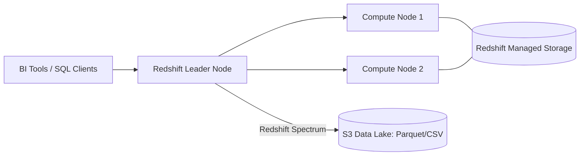

---
tags:
  - aws/service
  - aws/database
  - aws/analytics
domain: Database
status: evergreen
exam_priority: ⭐⭐⭐⭐
---

# Specialized Databases (Redshift, Neptune, OpenSearch)

> [!abstract] Overview
> Purpose-built AWS database and analytics engines designed for specialized workloads: Data Warehousing (Redshift), Graph queries (Neptune), Full-text search and Log analytics (OpenSearch), Time-Series (Timestream), and Document (DocumentDB).

---

## 🏢 1. Amazon Redshift (OLAP Data Warehouse)

- **Architecture**: Columnar storage, massively parallel processing (MPP), leader node + compute nodes (RA3 instances).
- **Redshift Spectrum**: Query exabytes of unstructured/structured data directly in **Amazon S3** without loading it into Redshift tables.
- **Concurrency Scaling**: Automatically adds transient cluster capacity to handle surges in concurrent analytical queries.

---

## 🕸️ 2. Amazon Neptune (Graph Database)
- Fully managed graph database engine supporting **Apache TinkerPop Gremlin**, **SPARQL**, and **openCypher**.
- Highly optimized for navigating billions of highly connected relationships with millisecond query speeds.
- **Ideal Use Cases**: Fraud detection rings, social networking graphs, recommendation engines, knowledge graphs, network topology mapping.

---

## 🔍 3. Amazon OpenSearch Service (Search & Log Analytics)
- Managed successor to Amazon Elasticsearch Service.
- Provides real-time search, log analytics, distributed full-text search, and visualization via OpenSearch Dashboards (Kibana).
- Commonly paired with [[Amazon CloudWatch & CloudTrail]] and [[Amazon Kinesis (Streams, Firehose, Analytics)]] for application log ingestion.

---

## ⏱️ 4. Other Purpose-Built Databases
- **Amazon Timestream**: Fast, scalable serverless time-series database for IoT sensor data, DevOps telemetry, and operational metrics.
- **Amazon DocumentDB**: Fully managed JSON document database compatible with **MongoDB**.
- **Amazon Keyspaces**: Fully managed, serverless database service compatible with **Apache Cassandra**.
- **Amazon QLDB (Quantum Ledger Database)**: Fully managed, immutable, cryptographically verifiable transaction ledger owned by a central authority.

---

## ⚡ High-Yield Exam Tips

> [!tip] Exam Triggers
> - **"Query petabytes of historical structured data for business intelligence / OLAP reports"** $\rightarrow$ **Amazon Redshift**.
> - **"Query data residing directly in S3 data lake using standard SQL without loading"** $\rightarrow$ **Amazon Redshift Spectrum** or **Amazon Athena**.
> - **"Detect fraudulent transactions by analyzing relationships between bank accounts and devices"** $\rightarrow$ **Amazon Neptune**.
> - **"Full-text search catalog or real-time application log indexing and visualization"** $\rightarrow$ **Amazon OpenSearch Service**.

---

## 🔗 Related Notes
- [[Databases MOC]]
- [[Decision Matrix - Database Selection]]
- [[Amazon S3 Deep Dive]]
- [[Amazon Kinesis (Streams, Firehose, Analytics)]]
