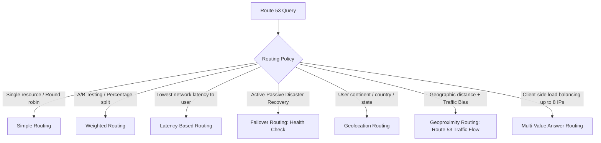

---
tags:
  - aws/service
  - aws/networking
  - aws/dns
domain: Networking
status: evergreen
exam_priority: ⭐⭐⭐⭐⭐
---

# Amazon Route 53 Routing Policies

> [!abstract] Overview
> Amazon Route 53 is a highly available and scalable cloud Domain Name System (DNS) web service (Port 53) providing domain registration, DNS routing, and health checking with automatic failover.

---

## 🧭 Route 53 Routing Policy Cheat Sheet

### Detailed Routing Matrix

| Policy | How It Works | Primary Use Case | Health Checks Supported? |
| :--- | :--- | :--- | :--- |
| **Simple** | Returns one or multiple IP addresses in random order | Single server or simple round-robin | No |
| **Weighted** | Assigns percentage weights (e.g., 80% to v1, 20% to v2) | **A/B Testing, Canary releases, gradual migrations** | Yes |
| **Latency-Based** | Routes to AWS region that provides the lowest network latency | **Global low-latency user experience** | Yes |
| **Failover** | Routes to Primary; switches to Secondary if Primary fails health check | **Active-Passive Disaster Recovery** | **Yes (Required)** |
| **Geolocation** | Routes based on the geographic location of the DNS requester (IP location)| **Localized content, language routing, legal compliance** | Yes |
| **Geoproximity** | Routes based on geographic location of resources + adjustable **Bias** | Shifting traffic dynamically across regions | Yes (via Traffic Flow) |
| **Multi-Value** | Returns up to 8 healthy records randomly for client-side balancing | Simple DNS-level resilience and load distribution | Yes |

---

## 🎯 Alias Records vs CNAME Records

| Dimension | Alias Record (AWS-Specific) | CNAME Record (Standard DNS) |
| :--- | :--- | :--- |
| **Zone Apex (`example.com`)**| **Supported** (Can be root domain) | ❌ **NOT supported** for zone apex |
| **Target** | AWS Resources (ALB, CloudFront, S3 Website, API GW) | Any canonical domain name (`abc.com`) |
| **DNS Query Charges** | **Free queries** to AWS resources | Standard Route 53 query charges apply |
| **Health Checking** | Supported natively | Not supported |

---

## ⚡ High-Yield Exam Tips

> [!tip] Exam Triggers
> - **"Route traffic to zone apex root domain (`example.com`) pointing to CloudFront or ALB"** $\rightarrow$ **Route 53 Alias Record**.
> - **"Active-Passive disaster recovery failover between two regions"** $\rightarrow$ **Failover Routing Policy with Route 53 Health Checks**.
> - **"Canary deployment sending 10% traffic to new application version"** $\rightarrow$ **Weighted Routing Policy**.
> - **"Serve European users European content and US users US content"** $\rightarrow$ **Geolocation Routing Policy**.
> - **"Hybrid DNS resolution between on-prem Active Directory and AWS VPC Private Hosted Zones"** $\rightarrow$ **Route 53 Resolver (Inbound & Outbound Endpoints)**.

---

## 🔗 Related Notes
- [[CloudFront & Global Accelerator]]
- [[High Availability & DR Strategies]]
- [[EC2 Auto Scaling & Load Balancing]]
