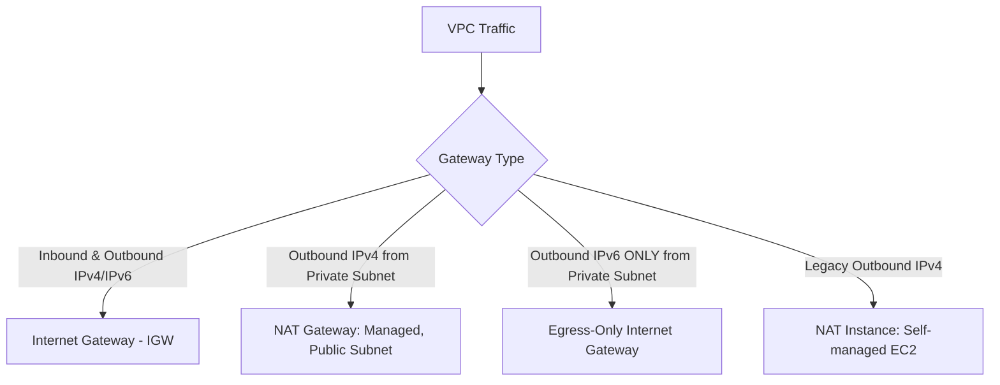

---
tags:
  - aws/service
  - aws/networking
domain: Networking
status: evergreen
exam_priority: ⭐⭐⭐⭐⭐
---

# Gateways (IGW, NAT GW, Egress-Only)

> [!abstract] Overview
> AWS VPC Gateways provide external egress and ingress routing for IPv4 and IPv6 traffic, bridging private VPC subnets to the public internet securely.

---

## 🚪 VPC Gateway Types & Architectures



---

## 1. Internet Gateway (IGW)
- VPC-level component that is horizontally scalable, redundant, and highly available by default.
- Performs 1:1 Network Address Translation (NAT) for instances with public IPv4 addresses.
- Exactly **1 IGW can be attached per VPC**.

---

## 2. NAT Gateway (Managed) vs NAT Instance

| Feature | AWS Managed NAT Gateway | NAT Instance (Self-Managed EC2) |
| :--- | :--- | :--- |
| **High Availability** | **Highly available within its AZ** (up to 45 Gbps) | Single EC2 instance (requires manual ASG script) |
| **Maintenance** | Managed by AWS (no OS patching) | Managed by customer (OS updates, security patches) |
| **Public Subnet & EIP**| **Must be deployed in a Public Subnet with Elastic IP** | Deployed in Public Subnet with EIP |
| **Source/Dest Check** | Automatic | **Must manually disable Source/Destination Check** |
| **Security Groups** | Does not use Security Groups | Uses Security Groups |
| **Port Forwarding / Bastion**| Not supported | Supported (can act as bastion host) |

```mermaid
graph LR
    subgraph MultiAZ_NAT ["High Availability NAT Architecture (1 per AZ)"]
        subgraph AZ_A ["AZ-A"]
            PrivA[Private Subnet A] --> NATA[NAT GW A (Public Subnet A)]
        end
        subgraph AZ_B ["AZ-B"]
            PrivB[Private Subnet B] --> NATB[NAT GW B (Public Subnet B)]
        end
    end
    NATA --> IGW[Internet Gateway]
    NATB --> IGW
```

> [!important] Multi-AZ NAT Gateway Architecture
> A NAT Gateway is AZ-bound. If the AZ containing the NAT Gateway goes down, all subnets routing through it lose internet egress.
> **Production Best Practice**: Deploy **one NAT Gateway per Availability Zone** and configure each private subnet's route table to route to the NAT Gateway in its local AZ.

---

## 3. Egress-Only Internet Gateway
- **For IPv6 ONLY**.
- Allows IPv6 traffic originating from instances in a private subnet to reach the internet, but **blocks any internet traffic from initiating an inbound connection** to the instances.
- Replaces the need for NAT in IPv6 (since IPv6 addresses are globally unique public IPs).

---

## ⚡ High-Yield Exam Tips

> [!tip] Exam Triggers
> - **"Allow private EC2 instances to download software patches from the internet without accepting inbound connections"** $\rightarrow$ **NAT Gateway** in a public subnet.
> - **"IPv6 instances need outbound internet access while blocking inbound internet requests"** $\rightarrow$ **Egress-Only Internet Gateway**.
> - **"NAT Gateway fails in AZ-A and disrupts private subnets in AZ-B"** $\rightarrow$ Redesign with **1 NAT Gateway per AZ** for multi-AZ fault tolerance.
> - **"Disable Source/Destination Check on EC2"** $\rightarrow$ Required for **NAT Instances** and 3rd party firewall appliances.

---

## 🔗 Related Notes
- [[VPC Architecture & Subnets]]
- [[Network Security (Security Groups, NACLs, WAF, Shield)]]
- [[Cost Optimization Pillar]]
