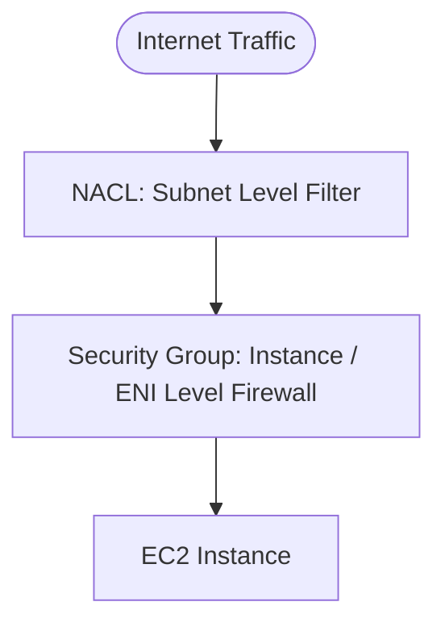

---
tags:
  - aws/service
  - aws/networking
  - aws/security
domain: Networking
status: evergreen
exam_priority: ⭐⭐⭐⭐⭐
---

# Network Security (Security Groups, NACLs, WAF, Shield)

> [!abstract] Overview
> AWS provides multi-layered network defense spanning instance firewalls (Security Groups), subnet packet filters (NACLs), application layer protection (AWS WAF), and distributed denial of service mitigation (AWS Shield).

---

## 🛡️ Security Groups vs Network ACLs (NACLs)

### Comprehensive Comparison Table

| Feature | Security Groups (SG) | Network ACLs (NACL) |
| :--- | :--- | :--- |
| **Operates At** | **Instance / ENI Level** | **Subnet Level** |
| **State Nature** | **Stateful** (Inbound return traffic automatically allowed) | **Stateless** (Inbound and Outbound evaluated independently) |
| **Rules Supported** | **ALLOW rules only** (Cannot explicitly deny an IP) | **ALLOW and DENY rules** (Numerical order evaluation) |
| **Rule Order** | All rules evaluated simultaneously | Evaluated in **ascending order** (Rule 100 before 200) |
| **Ephemeral Ports** | Handled automatically due to statefulness | **Must explicitly allow outbound Ephemeral Ports (1024-65535)** |
| **SG Referencing** | Can reference other Security Groups by ID | Cannot reference SGs (CIDR blocks only) |

---

## 🧱 AWS WAF (Web Application Firewall)
- **Layer 7** inspection on **ALB**, **Amazon CloudFront**, **Amazon API Gateway**, and **AWS AppSync**.
- Protects against common web exploits:
  - SQL Injection (SQLi) & Cross-Site Scripting (XSS).
  - Rate-based rules (e.g., block IPs making >2,000 requests in 5 minutes).
  - Geo-blocking (block or allow specific countries).
  - AWS Managed Rules for OWASP Top 10 vulnerabilities.

---

## 🛡️ AWS Shield: Standard vs Advanced

| Feature | AWS Shield Standard | AWS Shield Advanced |
| :--- | :--- | :--- |
| **Cost** | **FREE** (Enabled automatically) | **$3,000 / month** + data transfer fees |
| **Protection Layer** | **Layer 3 / 4** (SYN floods, UDP reflection) | **Layer 3, 4, and 7** |
| **Protected Resources**| All AWS public services | CloudFront, Route 53, ALB, Global Accelerator, Elastic IPs |
| **DDoS Response Team** | No | **24/7 AWS Shield Response Team (SRT)** access |
| **Cost Protection** | No | **Financial protection against billing spikes** during DDoS |

---

## ⚡ High-Yield Exam Tips

> [!tip] Exam Triggers
> - **"Block a single malicious attacker IP address (`198.51.100.4/32`)"** $\rightarrow$ **Network ACL Deny Rule** or **AWS WAF IP Set** (Security Groups cannot DENY).
> - **"Web tier instances need to accept traffic ONLY from the Application Load Balancer"** $\rightarrow$ Configure EC2 Security Group to allow inbound HTTP/HTTPS referencing the **ALB's Security Group ID** (not CIDR).
> - **"Protect application against Layer 7 HTTP DDoS and brute-force login attacks"** $\rightarrow$ **AWS WAF Rate-Based Rule**.
> - **"Protect Route 53 and CloudFront against large-scale DDoS with 24/7 incident support and cost refund guarantee"** $\rightarrow$ **AWS Shield Advanced**.

---

## 🔗 Related Notes
- [[VPC Architecture & Subnets]]
- [[EC2 Auto Scaling & Load Balancing]]
- [[CloudFront & Global Accelerator]]
- [[Security Pillar]]
