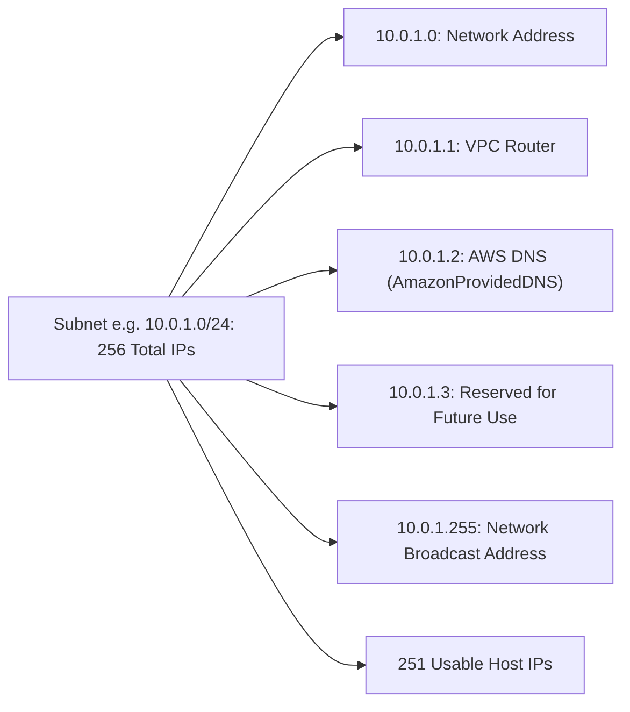

---
tags:
  - aws/service
  - aws/networking
  - aws/vpc
domain: Networking
status: evergreen
exam_priority: ⭐⭐⭐⭐⭐
---

# VPC Architecture & Subnets

> [!abstract] Overview
> Amazon Virtual Private Cloud (Amazon VPC) lets you provision a logically isolated section of the AWS Cloud where you can launch AWS resources in a virtual network that you define.

---

## 📐 CIDR Blocks & Reserved IP Addresses

- VPC CIDR block size can range from `/16` (65,536 IPs) to `/28` (16 IPs).
- Standard RFC 1918 Private IP ranges:
  - `10.0.0.0/8` (e.g., `10.0.0.0/16`)
  - `172.16.0.0/12` (e.g., `172.16.0.0/16`)
  - `192.168.0.0/16` (e.g., `192.168.0.0/16`)

### ⚠️ The 5 Reserved IPs per Subnet
In every AWS subnet, **5 IP addresses** are always reserved by AWS and cannot be assigned:



> [!example] Sizing Calculation
> If a subnet is `/28` (16 total addresses) $\rightarrow 16 - 5 = 11\text{ usable host IP addresses}$.

---

## 🏢 Multi-Tier Subnet Topology

```mermaid
graph TD
    subgraph PublicSubnet ["Public Subnet (Route to IGW)"]
        ALB[[EC2 Auto Scaling & Load Balancing|Application Load Balancer]]
        NAT[[Gateways (IGW, NAT GW, Egress-Only)|NAT Gateway]]
    end
    
    subgraph PrivateSubnet ["Private Subnet (Route to NAT GW)"]
        AppEC2[EC2 App Instances / ECS Tasks]
    end
    
    subgraph IsolatedSubnet ["Isolated Subnet (No Internet Route)"]
        Database[(Amazon RDS / Aurora)]
    end
    
    ALB --> AppEC2
    AppEC2 --> Database
    AppEC2 -.->|Outbound updates| NAT
```

1. **Public Subnet**: Route table contains a route to an **Internet Gateway (IGW)** (`0.0.0.0/0 -> igw-xxxx`). Instances can have public IPs.
2. **Private Subnet**: Route table routes internet-bound traffic to a **NAT Gateway** (`0.0.0.0/0 -> nat-xxxx`). No direct inbound access from internet.
3. **Isolated / Data Subnet**: No default route (`0.0.0.0/0`) to IGW or NAT GW. Strictly accessible only from internal VPC subnets.

---

## ⚡ High-Yield Exam Tips

> [!tip] Exam Rules
> - Subnets **cannot span multiple Availability Zones**; each subnet resides entirely within exactly **one AZ**.
> - VPC CIDR blocks can be expanded by adding secondary CIDR blocks, but cannot overlap with peered networks or on-prem networks.
> - The default route table in a new VPC allows full internal communication between all subnets in the VPC (`local` route).

---

## 🔗 Related Notes
- [[Gateways (IGW, NAT GW, Egress-Only)]]
- [[Network Security (Security Groups, NACLs, WAF, Shield)]]
- [[VPC Peering vs Transit Gateway vs PrivateLink]]
