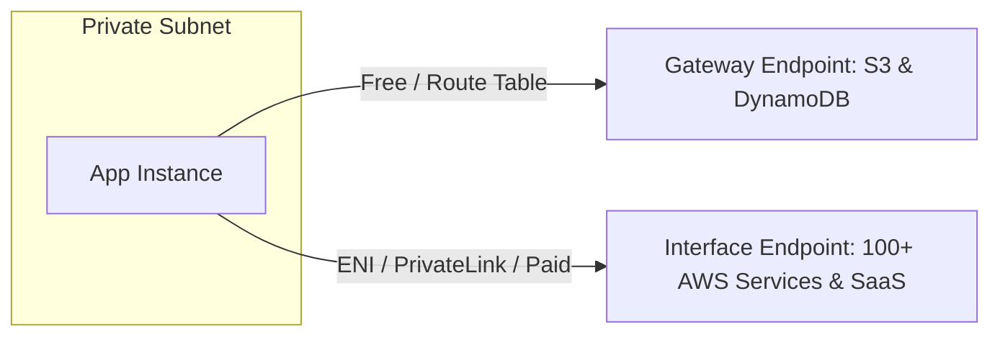

---
tags:
  - aws/service
  - aws/networking
  - aws/architecture
domain: Networking
status: evergreen
exam_priority: ⭐⭐⭐⭐⭐
---

# VPC Peering vs Transit Gateway vs PrivateLink

> [!abstract] Overview
> When connecting multiple VPCs, on-premises networks, and third-party SaaS applications, choosing between VPC Peering, AWS Transit Gateway, and AWS PrivateLink (VPC Endpoints) determines scalability, network routing complexity, and cost.

---

## 🧭 Inter-VPC Connectivity Decision Flowchart

```mermaid
graph TD
    Conn[Multi-VPC Connection Need] --> Pattern{Network Pattern}
    
    Pattern -->|Few VPCs 2-3 / Direct 1-to-1 / Lowest Cost| Peering[[VPC Peering vs Transit Gateway vs PrivateLink|VPC Peering]]
    Pattern -->|Complex Hub-and-Spoke / Transitive / Hundreds of VPCs / VPN+DX| TGW[[VPC Peering vs Transit Gateway vs PrivateLink|Transit Gateway]]
    Pattern -->|Expose specific service privately / Overlapping CIDRs| PrivateLink[[VPC Peering vs Transit Gateway vs PrivateLink|AWS PrivateLink]]
    Pattern -->|Access S3 or DynamoDB privately for free| GatewayEP[VPC Gateway Endpoint]
```

---

## 1. VPC Peering (1-to-1 Mesh)
- Connects two VPCs using AWS backbone network with private IPv4/IPv6 addresses.
- Supports cross-account and cross-region peering.
- ❌ **Non-Transitive**: If VPC A is peered with VPC B, and VPC B is peered with VPC C, **VPC A cannot talk to VPC C** through VPC B.
- ❌ Cannot have **overlapping CIDR blocks**.
- Scaling formula: $\frac{N(N-1)}{2}$ connections (10 VPCs = 45 peering links $\rightarrow$ high management overhead).

---

## 2. AWS Transit Gateway (Hub-and-Spoke)
- Regional network transit hub that connects thousands of VPCs, AWS Direct Connect, and VPN connections.
- ✅ **Supports Transitive Routing**: VPC A $\rightarrow$ Transit Gateway $\rightarrow$ VPC C.
- ✅ Simplifies complex architectures into a centralized hub with route domain segmentation.
- ✅ Supports **Multicast**, IPsec VPN acceleration, and AWS Resource Access Manager (RAM) sharing.
- 💰 Cost: Hourly attachment fee + data processing fee per GB.

---

## 3. VPC Endpoints & AWS PrivateLink



### Gateway Endpoints vs Interface Endpoints

| Feature | Gateway Endpoints | Interface Endpoints (AWS PrivateLink) |
| :--- | :--- | :--- |
| **Supported Services** | **Amazon S3** and **Amazon DynamoDB** ONLY | 100+ AWS services, SaaS partners, custom services |
| **Mechanism** | Route Table entry pointing to gateway target | **Elastic Network Interface (ENI)** with private IP in subnet |
| **Cost** | **FREE (Zero hourly or data charges)** | Hourly ENI fee + data processing fee per GB |
| **Access from On-Premises**| ❌ No (Cannot access via Direct Connect/VPN)| ✅ **Yes** (Accessible over Direct Connect and VPN) |
| **DNS Resolution** | Standard public DNS names | Private DNS integration |

---

## ⚡ High-Yield Exam Tips

> [!tip] Exam Triggers
> - **"Connect hundreds of VPCs with on-prem data centers and allow transitive communication"** $\rightarrow$ **AWS Transit Gateway**.
> - **"Private EC2 instance needs to access S3 or DynamoDB without internet, NAT Gateway, or extra costs"** $\rightarrow$ **VPC Gateway Endpoint**.
> - **"On-prem datacenter needs to privately access an internal S3 bucket or AWS service over Direct Connect"** $\rightarrow$ **Interface Endpoint (PrivateLink)** (Gateway Endpoints cannot be reached from on-prem).
> - **"Share a microservice across accounts with overlapping CIDR blocks securely"** $\rightarrow$ **AWS PrivateLink**.

---

## 🔗 Related Notes
- [[VPC Architecture & Subnets]]
- [[Decision Matrix - Hybrid Connectivity]]
- [[Amazon S3 Deep Dive]]
- [[Cost Optimization Pillar]]
