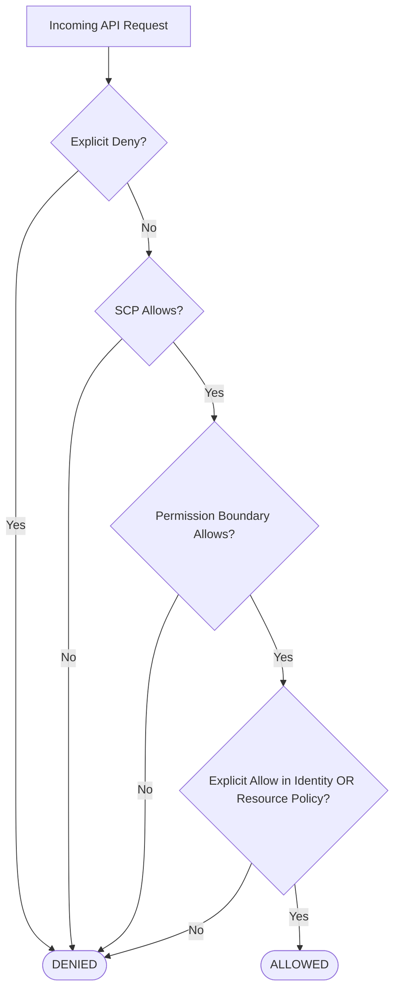
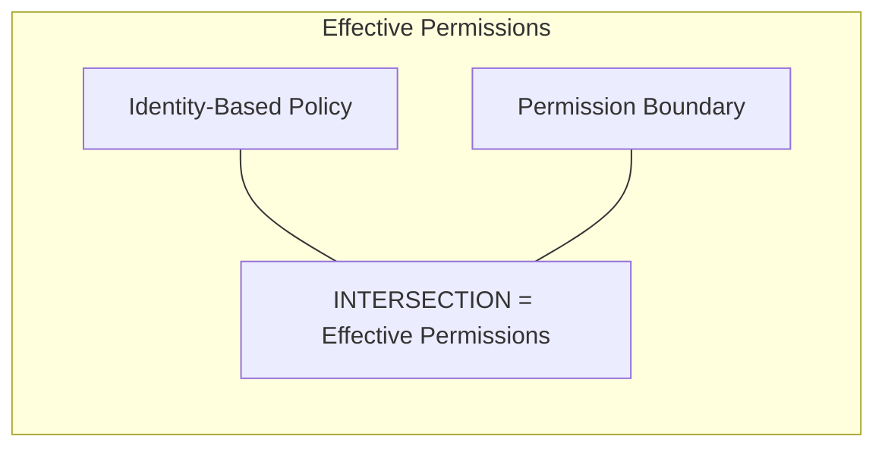

---
tags:
  - aws/service
  - aws/security
  - aws/iam
domain: Security
status: evergreen
exam_priority: ⭐⭐⭐⭐⭐
---

# AWS IAM (Policies, Roles, Delegation)

> [!abstract] Overview
> AWS Identity and Access Management (IAM) provides fine-grained access control across all AWS resources. It defines WHO (Principal) can access WHAT (Action + Resource) under WHICH conditions.

---

## ⚖️ IAM Policy Evaluation Logic

> [!important] The Golden Rule of IAM Evaluation
> **Explicit Deny ALWAYS wins over everything**, including explicit Allows. If no Allow is matched, the default decision is **Implicit / Default Deny**.

---

## 📜 Policy Types & Boundary Controls

1. **Identity-Based Policies**: Attached to IAM Users, Groups, or Roles. Defines what that identity can do.
2. **Resource-Based Policies**: Attached directly to resources (e.g., S3 Bucket Policies, KMS Key Policies, SQS Queue Policies).
3. **IAM Permission Boundaries**:
   - Advanced feature using a managed policy to set the **maximum permissions** that an identity-based policy can grant.
   - Prevents delegated admins from escalating their own privileges.

---

## 🎭 IAM Roles vs Instance Profiles vs STS

- **IAM Role**: An identity with specific permissions that can be assumed by anyone who needs it (temporary security credentials).
- **EC2 Instance Profile**: A container for an IAM role that allows EC2 instances to call AWS APIs without hardcoding credentials in code.
- **AWS Security Token Service (STS)**:
  - `AssumeRole`: Returns temporary credentials (15 mins to 12 hours) for cross-account or service access.
  - `AssumeRoleWithWebIdentity`: Federation with Google, Facebook, Amazon, or OIDC providers (Cognito).
  - `AssumeRoleWithSAML`: Federation with enterprise Active Directory / Okta using SAML 2.0.

---

## ⚡ High-Yield Exam Tips

> [!tip] Exam Triggers
> - **"EC2 instance needs to securely upload files to S3"** $\rightarrow$ Attach an **IAM Role to the EC2 Instance Profile** (NEVER store access keys on the instance).
> - **"Delegate admin access to create users while preventing them from granting full Admin privileges"** $\rightarrow$ **IAM Permission Boundary**.
> - **"Grant temporary access to resources across different AWS accounts"** $\rightarrow$ Cross-Account **IAM Role + STS `AssumeRole`**.
> - **"Allow thousands of mobile users to authenticate with Google/Apple and access S3"** $\rightarrow$ **Amazon Cognito Identity Pools (Federated Identities)**.

---

## 🔗 Related Notes
- [[AWS Organizations & SCPs]]
- [[KMS & Secrets Manager]]
- [[Security Pillar]]
