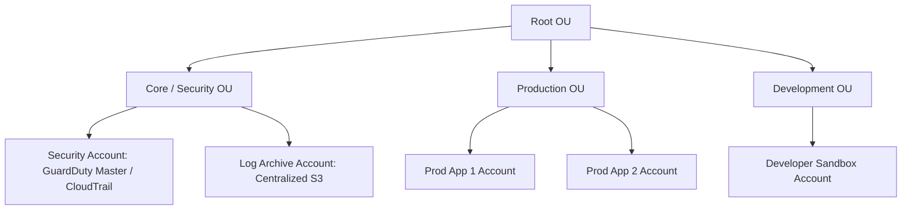
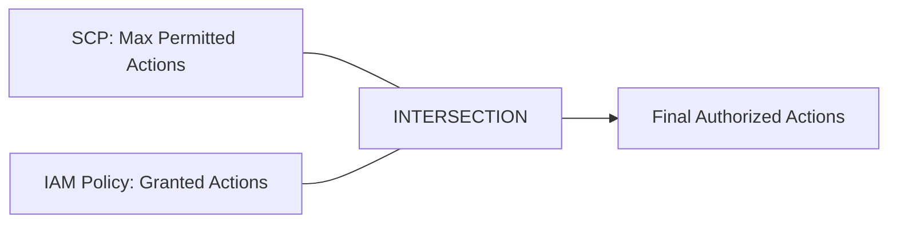

---
tags:
  - aws/service
  - aws/security
  - aws/governance
domain: Security
status: evergreen
exam_priority: ⭐⭐⭐⭐⭐
---

# AWS Organizations & SCPs

> [!abstract] Overview
> AWS Organizations offers centralized governance, multi-account management, consolidated billing, and hierarchical security policies (Service Control Policies - SCPs) across your organization.

---

## 🌳 AWS Organizations Hierarchy

---

## 🛡️ Service Control Policies (SCPs)

- **Purpose**: Guardrails that define the **maximum available permissions** for accounts or Organizational Units (OUs).
- **Inheritance**: Applied hierarchically. Policies applied to Root cascade down to all child OUs and member accounts.
- **Root User Included**: SCPs affect **ALL users and roles in member accounts, INCLUDING the member account's root user** (SCPs do NOT apply to the Management/Payer account).
- **Filtering Nature**: SCPs **do not grant permissions**; they act as a filter. An IAM user still needs an explicit IAM `Allow` policy.

---

## 💰 Consolidated Billing & AWS Control Tower
1. **Consolidated Billing**:
   - Single bill for all member accounts.
   - Aggregates usage across accounts to qualify for volume pricing discounts on S3, EC2, and Data Transfer.
   - Sharing of Reserved Instances (RIs) and Savings Plans discounts across all member accounts.
2. **AWS Control Tower**:
   - Managed service to set up an automated multi-account environment (**AWS Landing Zone**).
   - Enforces **Guardrails**:
     - *Preventative Guardrails*: Enforced using SCPs (e.g., prevent disabling CloudTrail).
     - *Detective Guardrails*: Enforced using [[AWS Config & Systems Manager]] rules.

---

## ⚡ High-Yield Exam Tips

> [!tip] Exam Triggers
> - **"Centrally restrict member accounts from deploying resources in unapproved AWS regions"** $\rightarrow$ **SCP with `Deny` on `aws:RequestedRegion`** attached at the Root OU.
> - **"Ensure no member account, even root user, can delete or alter centralized CloudTrail logs"** $\rightarrow$ **SCP denying `cloudtrail:StopLogging` and `cloudtrail:DeleteTrail`**.
> - **"Maximize volume discounts and share Reserved Instance benefits across all company accounts"** $\rightarrow$ **AWS Organizations Consolidated Billing**.

---

## 🔗 Related Notes
- [[AWS IAM (Policies, Roles, Delegation)]]
- [[AWS Config & Systems Manager]]
- [[Security Pillar]]
