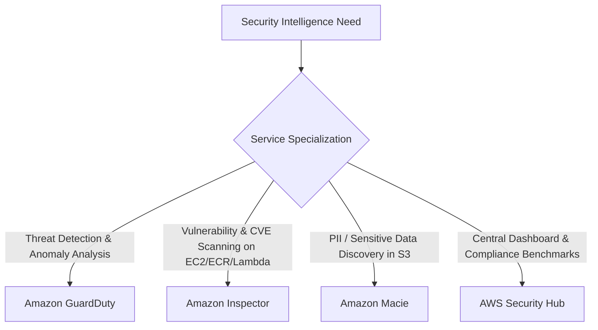

---
tags:
  - aws/service
  - aws/security
domain: Security
status: evergreen
exam_priority: ⭐⭐⭐⭐⭐
---

# AWS Security Services (GuardDuty, Inspector, Macie, Security Hub)

> [!abstract] Overview
> AWS specialized security services provide automated threat detection, continuous vulnerability scanning, sensitive data discovery, and centralized security posture management across all AWS accounts.

---

## 🔍 Security Services Comparison Matrix

### Detailed Feature Breakdown

| Service | Category | What It Analyzes | Key Differentiator |
| :--- | :--- | :--- | :--- |
| **Amazon GuardDuty** | **Threat Detection** | VPC Flow Logs, CloudTrail Management/Data Events, DNS Logs, EKS Audit Logs, S3 Logs | Uses Machine Learning to detect compromised EC2 instances, crypto-mining, abnormal API calls. **Zero performance impact** (independent log parsing). |
| **Amazon Inspector** | **Vulnerability Assessment** | EC2 instances (SSM agent), ECR container images, Lambda functions | Continuously scans for Common Vulnerabilities and Exposures (**CVEs**) and unintended network accessibility. |
| **Amazon Macie** | **Data Privacy & PII Scanner**| Amazon S3 bucket contents | Uses pattern matching and NLP to discover Personally Identifiable Information (**PII**), credit cards, passports, and exposed buckets. |
| **AWS Security Hub** | **Central Posture Management (CSPM)**| Aggregates findings from GuardDuty, Inspector, Macie, IAM Access Analyzer, Firewall Mgr | Generates an overall compliance score against **CIS AWS Foundations**, **PCI-DSS**, and NIST frameworks. |

---

## ⚡ High-Yield Exam Tips

> [!tip] Exam Triggers
> - **"Detect compromised EC2 instance communicating with known malicious Bitcoin mining IP addresses"** $\rightarrow$ **Amazon GuardDuty**.
> - **"Scan container images in Amazon ECR for software vulnerabilities before deploying to production"** $\rightarrow$ **Amazon Inspector**.
> - **"Audit all S3 buckets across the organization to locate exposed credit card numbers and PII"** $\rightarrow$ **Amazon Macie**.
> - **"Provide a single centralized dashboard of all security alerts and compliance against CIS benchmarks"** $\rightarrow$ **AWS Security Hub**.
> - **"Automate remediation of GuardDuty findings"** $\rightarrow$ **GuardDuty $\rightarrow$ EventBridge Rule $\rightarrow$ Lambda function / SSM Automation**.

---

## 🔗 Related Notes
- [[Security MOC]]
- [[Security Pillar]]
- [[AWS Organizations & SCPs]]
- [[Network Security (Security Groups, NACLs, WAF, Shield)]]
