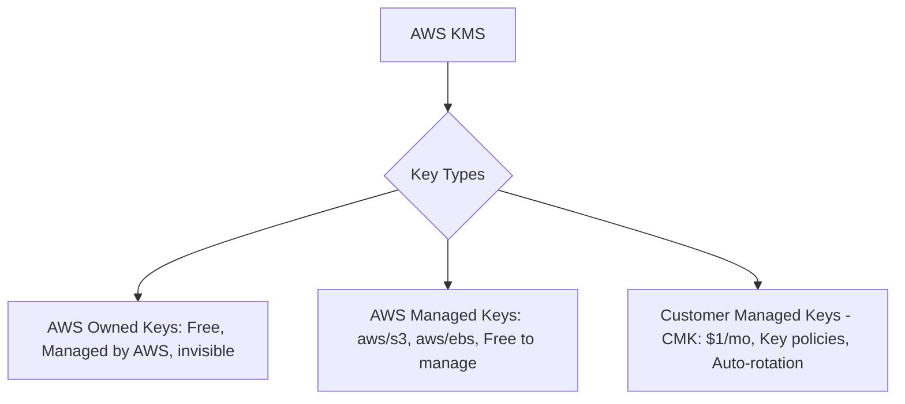

---
tags:
  - aws/service
  - aws/security
  - aws/encryption
domain: Security
status: evergreen
exam_priority: ⭐⭐⭐⭐⭐
---

# KMS & Secrets Manager

> [!abstract] Overview
> AWS Key Management Service (KMS) manages encryption keys and cryptographic operations. AWS Secrets Manager securely stores, rotates, and manages sensitive credentials, API keys, and database passwords.

---

## 🔑 AWS KMS Key Types & Envelope Encryption



### ✉️ Envelope Encryption Concept
1. KMS Customer Master Key (CMK) is used to generate a **Data Encryption Key (DEK)** via the `GenerateDataKey` API.
2. The plaintext DEK encrypts the actual large file/dataset locally.
3. The plaintext DEK is erased from memory; only the **Encrypted DEK** is stored alongside the encrypted data.
4. To decrypt: KMS `Decrypt` API decrypts the Encrypted DEK using the CMK, and plaintext DEK decrypts the file.

---

## 🥊 Secrets Manager vs SSM Parameter Store

```mermaid
graph LR
    Secrets[Secret Storage Decision] --> Rotation{Requires Auto-Rotation?}
    Rotation -->|Yes: RDS, Redshift, DocumentDB, API Keys| SM[[KMS & Secrets Manager|Secrets Manager]]
    Rotation -->|No: Hierarchical configs, license keys, static passwords| SSM[[AWS Config & Systems Manager|SSM Parameter Store]]
```

### Direct Feature Comparison

| Feature | AWS Secrets Manager | AWS Systems Manager Parameter Store |
| :--- | :--- | :--- |
| **Primary Focus** | **Database credentials, API tokens, sensitive secrets** | **Hierarchical app configs, strings, AMI IDs** |
| **Automatic Rotation** | **Built-in automated rotation via Lambda (RDS, Aurora, Redshift)** | Manual or custom EventBridge + Lambda required |
| **Cross-Account Access**| Natively supported via Resource Policies | Requires IAM role assumption |
| **Pricing** | $0.40 per secret/month + $0.05 per 10k API calls | **Standard tier is FREE**; Advanced tier $0.05/month |
| **Encryption** | Always encrypted using KMS | Plaintext (`String`, `StringList`) or KMS (`SecureString`) |

---

## ⚡ High-Yield Exam Tips

> [!tip] Exam Triggers
> - **"Automatically rotate database passwords for Amazon RDS every 30 days without application downtime"** $\rightarrow$ **AWS Secrets Manager** with built-in rotation Lambda.
> - **"Store application configurations and AMI IDs with version tracking at the lowest cost"** $\rightarrow$ **AWS SSM Parameter Store (Standard Tier - Free)**.
> - **"Encrypt data across multiple regions using the same key ARN without re-encrypting"** $\rightarrow$ **AWS KMS Multi-Region Keys**.
> - **"Control access to a KMS key across accounts"** $\rightarrow$ **KMS Key Policy** (KMS keys CANNOT be controlled by IAM policies alone without key policy authorization).

---

## 🔗 Related Notes
- [[AWS IAM (Policies, Roles, Delegation)]]
- [[Amazon RDS & Aurora]]
- [[Security Pillar]]
