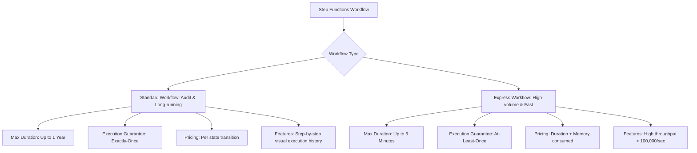
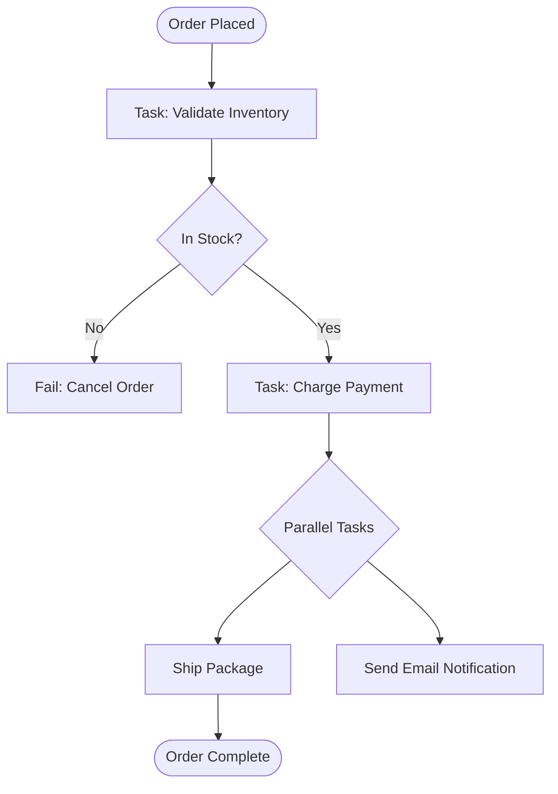

---
tags:
  - aws/service
  - aws/serverless
  - aws/orchestration
domain: Integration
status: evergreen
exam_priority: ⭐⭐⭐⭐⭐
---

# AWS Step Functions

> [!abstract] Overview
> AWS Step Functions is a low-code, visual serverless workflow orchestrator that lets developers coordinate multiple AWS services into business-critical workflows, automated processes, and distributed sagas.

---

## 🔄 Standard vs Express Workflows

### Direct Feature Comparison

| Feature | Standard Workflows | Express Workflows |
| :--- | :--- | :--- |
| **Max Duration** | **Up to 1 Year** | **Up to 5 Minutes** |
| **Execution Rate** | Up to 2,000 executions/second | **Over 100,000 executions/second** |
| **Execution Guarantee**| **Exactly-once execution** | **At-least-once execution** |
| **Pricing Model** | Charged per **state transition** ($0.025 / 1k transitions) | Charged on **execution time & memory** |
| **Audit / History** | Full visual execution history maintained for 90 days | Execution logs sent to CloudWatch Logs |
| **Ideal For** | Order fulfillment, payment checkout, manual human approvals, ETL | IoT data ingestion, real-time streaming, high-volume APIs |

---

## 🧩 Common State Types & Saga Pattern
- **Task State**: Executes work using AWS services (Lambda, ECS, DynamoDB, Batch).
- **Choice State**: Adds branching logic based on input values (if/then/else).
- **Parallel State**: Executes multiple workflow branches simultaneously.
- **Map State**: Iterates over a dynamic array of items concurrently.
- **Wait State**: Delays execution for a specific duration or until a timestamp.

---

## ⚡ High-Yield Exam Tips

> [!tip] Exam Triggers
> - **"Orchestrate complex multi-step workflow with retries, catch blocks, and human approval steps"** $\rightarrow$ **AWS Step Functions (Standard Workflow)**.
> - **"High-volume, short-duration data ingestion from IoT devices or Kinesis (> 10,000 events/sec)"** $\rightarrow$ **AWS Step Functions (Express Workflow)**.
> - **"Coordinate distributed microservice transactions with automated compensating rollbacks (Saga Pattern)"** $\rightarrow$ **AWS Step Functions**.

---

## 🔗 Related Notes
- [[AWS Lambda]]
- [[Amazon EventBridge]]
- [[Decision Matrix - Decoupling & Messaging]]
