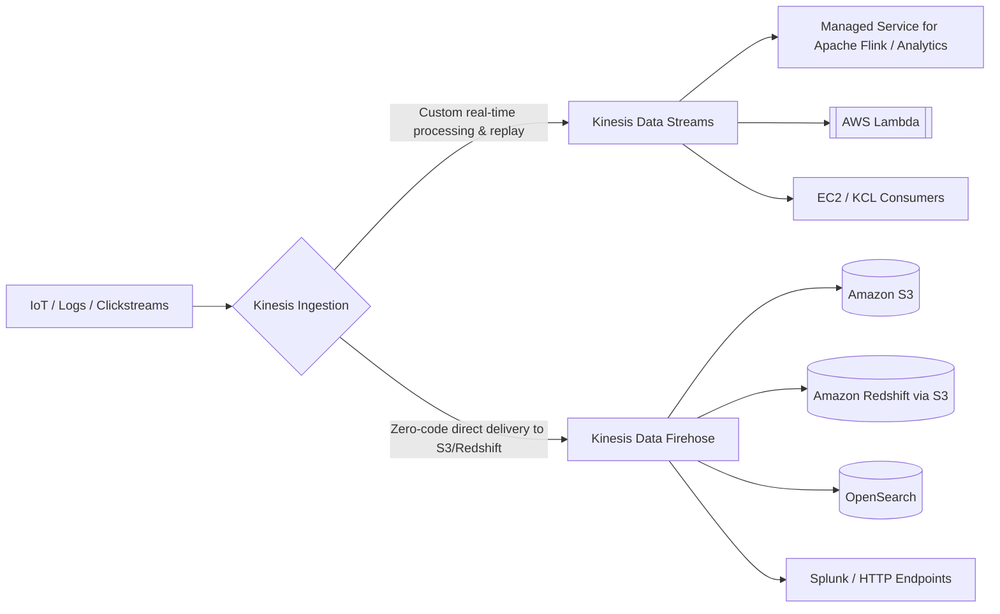

---
tags:
  - aws/service
  - aws/streaming
  - aws/analytics
domain: Integration
status: evergreen
exam_priority: ⭐⭐⭐⭐⭐
---

# Amazon Kinesis (Streams, Firehose, Analytics)

> [!abstract] Overview
> Amazon Kinesis makes it easy to collect, process, and analyze real-time streaming data at any scale (video, audio, application logs, website clickstreams, and IoT telemetry).

---

## 🌊 The Kinesis Suite Overview

---

## 🥊 Kinesis Data Streams vs Kinesis Data Firehose

| Feature | Kinesis Data Streams (KDS) | Kinesis Data Firehose (KDF) |
| :--- | :--- | :--- |
| **Latency** | **Real-time (sub-second: ~70ms)** | **Near real-time (buffer interval: 60s - 900s)** |
| **Management** | Provisioned (Shards) or On-Demand | **Fully Serverless (Auto-scaling)** |
| **Data Storage / Replay**| **Stores data 24 hours to 365 days (Replayable)**| **No storage (transient delivery pipeline)** |
| **Consumers** | Custom applications (KCL, SDK, Lambda) | AWS Targets: **S3, Redshift, OpenSearch, HTTP, Splunk** |
| **Transformation** | Custom processing | **Built-in inline Lambda transformation** |

---

## 📊 Kinesis Data Streams Shard Capacity
- **1 Shard Ingestion Capacity**: **1 MB/second** or **1,000 records/second**.
- **1 Shard Egress / Read Capacity**: **2 MB/second** (shared across all consumers) or **Enhanced Fan-Out (2 MB/s dedicated per consumer via HTTP/2)**.
- **Capacity Modes**:
  - *Provisioned Mode*: Scale shards manually or with application auto-scaling.
  - *On-Demand Mode*: Automatically scales throughput up to 200 MB/s write and 400 MB/s read.

---

## ⚡ High-Yield Exam Tips

> [!tip] Exam Triggers
> - **"Real-time data ingestion with multiple independent consumer applications reading and replaying data at different speeds"** $\rightarrow$ **Amazon Kinesis Data Streams**.
> - **"Stream IoT data directly into Amazon S3, Amazon Redshift, or OpenSearch with zero consumer code and optional transformation"** $\rightarrow$ **Amazon Kinesis Data Firehose**.
> - **"Eliminate read throughput contention when multiple consumers read from the same Kinesis stream simultaneously"** $\rightarrow$ Enable **Enhanced Fan-Out (EFO)**.
> - **"Run real-time SQL / stream processing over streaming data"** $\rightarrow$ **Amazon Managed Service for Apache Flink (formerly Kinesis Data Analytics)**.

---

## 🔗 Related Notes
- [[Amazon SQS (Standard, FIFO, DLQ)]]
- [[Specialized Databases (Redshift, Neptune, OpenSearch)]]
- [[Decision Matrix - Decoupling & Messaging]]
