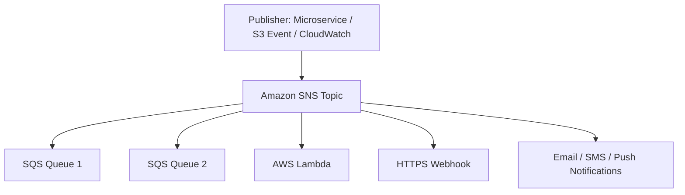
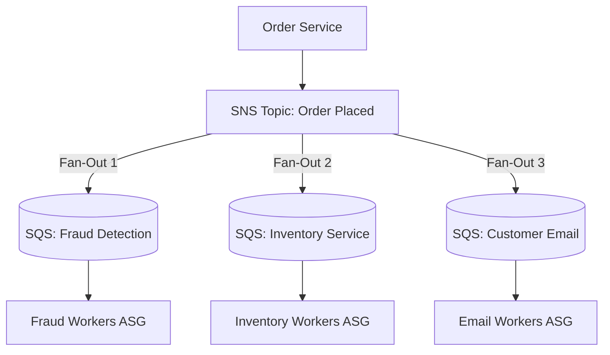

---
tags:
  - aws/service
  - aws/messaging
  - aws/pubsub
domain: Integration
status: evergreen
exam_priority: ⭐⭐⭐⭐⭐
---

# Amazon SNS & Fan-Out Pattern

> [!abstract] Overview
> Amazon Simple Notification Service (Amazon SNS) is a fully managed Pub/Sub messaging service for both application-to-application (A2A) microservices and application-to-person (A2P) notifications (SMS, Email, Push).

---

## 📢 Amazon SNS Architecture & Endpoints

### Key SNS Features
- **Publish/Subscribe Model**: Single publisher sends one message to a topic; topic broadcasts message instantaneously to multiple subscribers.
- **Message Filtering**: JSON filter policies attached to subscriptions ensure subscribers only receive messages matching specific attributes (reduces downstream Lambda/SQS invocations).
- **SNS FIFO Topics**: First-in-first-out pub/sub paired with SQS FIFO queues.

---

## 🔀 The Fan-Out Architectural Pattern

### Why Use SNS + SQS Fan-Out?
1. **Full Decoupling**: The order service only sends 1 message and has zero knowledge of downstream consumers.
2. **Independent Scaling**: Each consumer queue scales its own worker pool at its own rate.
3. **Fault Isolation & Retries**: If the email service goes down, messages buffer safely in its SQS queue without impacting fraud detection or inventory.
4. **Data Persistence**: SQS provides durable buffering (up to 14 days) while SNS is transient.

---

## ⚡ High-Yield Exam Tips

> [!tip] Exam Triggers
> - **"Publish a single event to multiple independent worker systems for parallel, decoupled asynchronous processing"** $\rightarrow$ **SNS + SQS Fan-Out Pattern**.
> - **"Send immediate emergency SMS / Email alerts to mobile devices and operations staff"** $\rightarrow$ **Amazon SNS Topic**.
> - **"Prevent downstream subscribers from receiving irrelevant messages without writing application filter code"** $\rightarrow$ **SNS Subscription Filter Policies**.

---

## 🔗 Related Notes
- [[Amazon SQS (Standard, FIFO, DLQ)]]
- [[Amazon EventBridge]]
- [[Decision Matrix - Decoupling & Messaging]]
