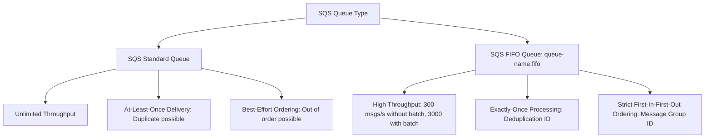
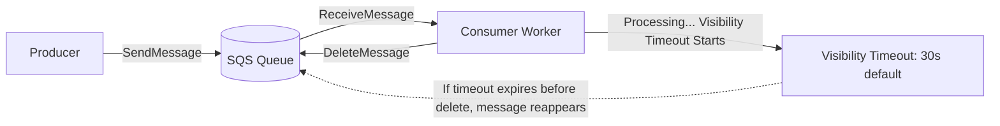

---
tags:
  - aws/service
  - aws/messaging
  - aws/serverless
domain: Integration
status: evergreen
exam_priority: ⭐⭐⭐⭐⭐
---

# Amazon SQS (Standard, FIFO, DLQ)

> [!abstract] Overview
> Amazon Simple Queue Service (Amazon SQS) is a fully managed message queuing service that enables you to decouple and scale microservices, distributed systems, and serverless applications.

---

## 🥊 SQS Standard vs SQS FIFO

### Direct Feature Comparison

| Feature | SQS Standard Queue | SQS FIFO Queue |
| :--- | :--- | :--- |
| **Throughput** | **Nearly unlimited** | 300 msgs/s (3,000 with batching; up to 70k high-throughput) |
| **Delivery Guarantee**| **At-least-once delivery** (occasional duplicate)| **Exactly-once processing** |
| **Ordering** | Best-effort ordering | **Strict FIFO ordering** |
| **Queue Name** | Any alphanumeric name | **Must end with `.fifo` suffix** |
| **Ordering Key** | None | **Message Group ID** (groups ordered streams) |
| **Deduplication** | Application level | **Message Deduplication ID** (or Content-Based Deduplication) |

---

## ⚙️ Core SQS Mechanics

1. **Visibility Timeout**:
   - Default: **30 seconds** (Min: 0s, Max: 12 hours).
   - Period during which SQS hides the message from other consumers while one worker processes it.
   - If worker needs more time: Call `ChangeMessageVisibility` API.
2. **Short Polling vs Long Polling (`WaitTimeSeconds`)**:
   - **Short Polling**: Returns immediately even if empty (high cost, empty receives).
   - **Long Polling (`WaitTimeSeconds = 1 to 20s`)**: Waits for messages to arrive before returning. **Reduces cost and eliminates empty responses**.
3. **Dead-Letter Queue (DLQ)**:
   - Quarantine queue for messages that fail processing after `maxReceiveCount` attempts.
   - Enables debugging and root cause analysis without blocking main queue processing.
4. **Message Retention & Size**:
   - Message retention: **4 days default**, configurable from **1 minute to 14 days**.
   - Max payload size: **256 KB** (Use **Amazon SQS Extended Client Library with S3** for up to 2 GB).

---

## ⚡ High-Yield Exam Tips

> [!tip] Exam Triggers
> - **"Decouple web servers from backend workers to smooth out traffic spikes"** $\rightarrow$ **Amazon SQS Standard Queue**.
> - **"Financial transactions or order processing where strict order and zero duplicate messages are required"** $\rightarrow$ **Amazon SQS FIFO Queue**.
> - **"Scale EC2 Auto Scaling Group based on incoming queue volume"** $\rightarrow$ Metric `ApproximateNumberOfMessagesVisible` / Number of EC2 instances + Target Tracking ASG.
> - **"Reduce costs and prevent empty response calls on SQS receives"** $\rightarrow$ Enable **Long Polling (`ReceiveMessageWaitTimeSeconds = 20`)**.
> - **"Messages fail processing repeatedly and get stuck"** $\rightarrow$ Set up a **Dead-Letter Queue (DLQ) with a Redrive Policy**.

---

## 🔗 Related Notes
- [[Amazon SNS & Fan-Out Pattern]]
- [[EC2 Auto Scaling & Load Balancing]]
- [[Decision Matrix - Decoupling & Messaging]]
- [[Reliability Pillar]]
