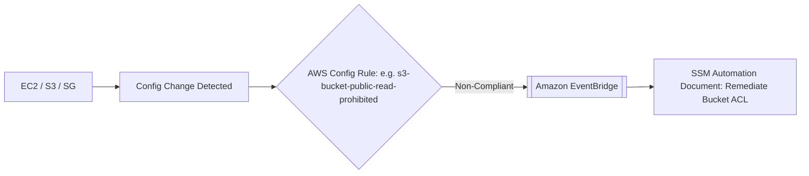
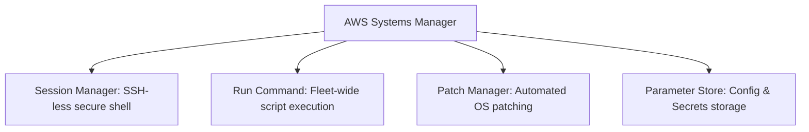

---
tags:
  - aws/service
  - aws/governance
  - aws/compliance
domain: Governance
status: evergreen
exam_priority: ⭐⭐⭐⭐⭐
---

# AWS Config & Systems Manager

> [!abstract] Overview
> AWS Config tracks resource configuration changes and evaluates them against compliance rules. AWS Systems Manager (SSM) provides centralized operational management, patching, and secure access for EC2 and on-prem instances.

---

## 📏 1. AWS Config & Automated Remediation

- **Managed Rules**: Pre-built rules provided by AWS (e.g., `restricted-ssh`, `encrypted-volumes`, `s3-bucket-ssl-requests-only`).
- **Custom Rules**: Lambda functions evaluating custom business logic.
- **Conformance Packs**: Collections of Config rules and remediation actions packaged as a single template (e.g., for PCI-DSS, HIPAA).
- **Remediation**: Executes SSM Automation runbooks to revert unapproved changes automatically.

---

## 🛠️ 2. AWS Systems Manager (SSM) Core Tools

1. **SSM Session Manager**:
   - Provides one-click browser-based or CLI interactive shell into EC2 instances without needing:
     - ❌ Open inbound port 22.
     - ❌ Public IP address or Bastion Host.
     - ❌ SSH key pairs.
   - All session commands are logged to **Amazon S3** or **CloudWatch Logs** for auditing.
2. **SSM Run Command**:
   - Executes shell scripts or Ansible playbooks across thousands of instances concurrently without SSH.
3. **SSM Patch Manager**:
   - Automates operating system security patch rollouts using customizable patch baselines and maintenance windows.

---

## ⚡ High-Yield Exam Tips

> [!tip] Exam Triggers
> - **"Provide secure administrative terminal access to private EC2 instances without opening port 22 or maintaining bastion hosts"** $\rightarrow$ **AWS Systems Manager Session Manager**.
> - **"Continuously monitor all Security Groups to ensure port 22 is never open to `0.0.0.0/0` and automatically close it"** $\rightarrow$ **AWS Config Rule + Systems Manager Automation Remediation**.
> - **"Apply OS patches to a fleet of 500 EC2 instances on a weekly schedule during non-business hours"** $\rightarrow$ **SSM Patch Manager + SSM Maintenance Windows**.

---

## 🔗 Related Notes
- [[Amazon CloudWatch & CloudTrail]]
- [[AWS Organizations & SCPs]]
- [[Operational Excellence Pillar]]
