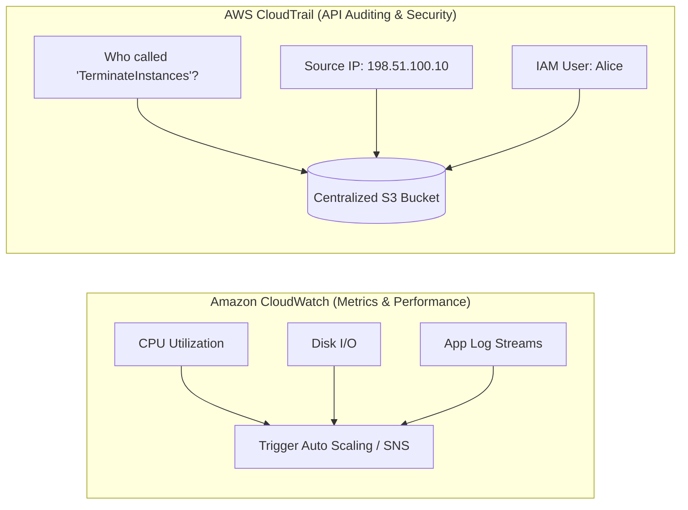

---
tags:
  - aws/service
  - aws/monitoring
  - aws/auditing
domain: Monitoring
status: evergreen
exam_priority: ⭐⭐⭐⭐⭐
---

# Amazon CloudWatch & CloudTrail

> [!abstract] Overview
> Amazon CloudWatch provides monitoring and observability for resources and applications. AWS CloudTrail provides auditing, security monitoring, and operational troubleshooting by tracking all user activity and API calls.

---

## 🥊 CloudWatch vs CloudTrail

---

## 1. Amazon CloudWatch Deep Dive
- **Metrics**:
  - *Standard Monitoring*: Metrics gathered every **5 minutes** (Free).
  - *Detailed Monitoring*: Metrics gathered every **1 minute** (Paid).
  - *High-Resolution Custom Metrics*: Down to **1-second** intervals.
- **CloudWatch Alarms**:
  - State: `OK`, `ALARM`, `INSUFFICIENT_DATA`.
  - Actions: Auto Scaling policy trigger, EC2 actions (Stop, Terminate, Reboot, Recover), SNS notifications.
- **CloudWatch Logs**:
  - Unified CloudWatch Agent: Collects guest OS metrics (RAM utilization, free disk space, swap) and log files from EC2.
  - Log Insights: Fast interactive SQL-like log querying.
- **CloudWatch Synthetics**: Generates headless browser scripts (Canaries) to monitor APIs and UI flows 24/7.

---

## 2. AWS CloudTrail Deep Dive
- **Event Types**:
  - **Management Events**: Control plane operations (e.g., `CreateBucket`, `RunInstances`, `AttachPolicy`). Logged by default for 90 days.
  - **Data Events**: High-volume data plane operations (e.g., `s3:GetObject`, `s3:PutObject`, `lambda:Invoke`). **Disabled by default (cost consideration)**.
  - **CloudTrail Insights**: Detects unusual operational activity and anomalous API call volume spikes.
- **Multi-Region Trail**: Ensures API calls across all AWS regions are logged to a single centralized S3 bucket with **Log File Integrity Validation (SHA-256 digests)** enabled.

---

## ⚡ High-Yield Exam Tips

> [!tip] Exam Triggers
> - **"Monitor EC2 memory/RAM utilization or disk space usage"** $\rightarrow$ Install the **Unified CloudWatch Agent** on the EC2 instance (Standard EC2 metrics do NOT track OS RAM/Disk).
> - **"Track which IAM user deleted an S3 bucket or altered a Security Group"** $\rightarrow$ **AWS CloudTrail Event History**.
> - **"Track every single file downloaded (`GetObject`) from an S3 bucket"** $\rightarrow$ Enable **CloudTrail S3 Data Events**.
> - **"Automatically recover an EC2 instance if host underlying hardware fails"** $\rightarrow$ **CloudWatch Alarm with EC2 Recover Action**.

---

## 🔗 Related Notes
- [[AWS Config & Systems Manager]]
- [[EC2 Auto Scaling & Load Balancing]]
- [[Operational Excellence Pillar]]
