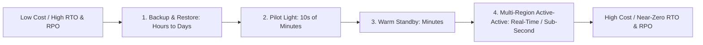
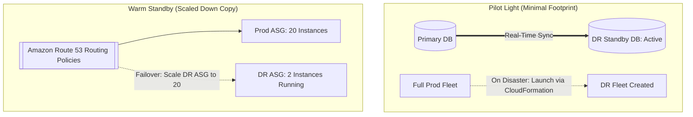

---
tags:
  - aws/architecture
  - aws/resilience
  - aws/dr
domain: Resilience
status: evergreen
exam_priority: ⭐⭐⭐⭐⭐
---

# High Availability & DR Strategies

> [!abstract] Overview
> Disaster Recovery (DR) in AWS is structured across 4 distinct architectural patterns balancing **Recovery Time Objective (RTO)**, **Recovery Point Objective (RPO)**, and overall **Cost**.

---

## 📊 The 4 Disaster Recovery Strategies

---

## 🔍 Detailed Pattern Comparison

| DR Strategy | Description | Data Tier | Compute Tier | RPO | RTO | Cost Profile |
| :--- | :--- | :--- | :--- | :--- | :--- | :--- |
| **1. Backup & Restore** | Regular data backups restored only after disaster occurs | S3 / Glacier / EBS Snapshots copied cross-region | **0 compute** running in DR region | **Hours to Days** | **Hours to Days** | 💲 **Lowest** |
| **2. Pilot Light** | Core data replicated continuously; minimal critical core services running | Continuously replicated (Aurora Global DB / DynamoDB Global) | **Core VMs off or minimal config**; scaled up upon disaster | **Minutes** | **10s of Minutes** | 💲💲 **Low** |
| **3. Warm Standby** | Scaled-down but fully functional copy running 24/7 in DR region | Continuously replicated | **Scaled-down fleet** running; sized up on failover | **Seconds to Minutes** | **Minutes** | 💲💲💲 **Medium** |
| **4. Multi-Region Active-Active**| Full capacity running concurrently in 2+ regions; traffic distributed | Bi-directional active replication | **Full production capacity** serving traffic in all regions | **Near-Zero** | **Near-Zero (Instant)**| 💲💲💲💲 **Highest** |

---

## 🏗️ Visual Architecture Comparison

---

## ⚡ High-Yield Exam Tips

> [!tip] Exam Triggers
> - **"Lowest cost DR strategy where recovery time of 24 hours is acceptable"** $\rightarrow$ **Backup and Restore**.
> - **"Database must be continuously replicated, but compute can be launched on demand via CloudFormation during disaster within 30 minutes"** $\rightarrow$ **Pilot Light**.
> - **"Scaled-down version of environment always running in secondary region for quick failover"** $\rightarrow$ **Warm Standby**.
> - **"Zero RTO and zero RPO with traffic served simultaneously from two global regions"** $\rightarrow$ **Multi-Region Active-Active (Route 53 Geolocation/Latency + Aurora Global DB / DynamoDB Global Tables)**.

---

## 🔗 Related Notes
- [[RTO & RPO Comparison]]
- [[Amazon Route 53 Routing Policies]]
- [[Amazon RDS & Aurora]]
- [[Reliability Pillar]]
