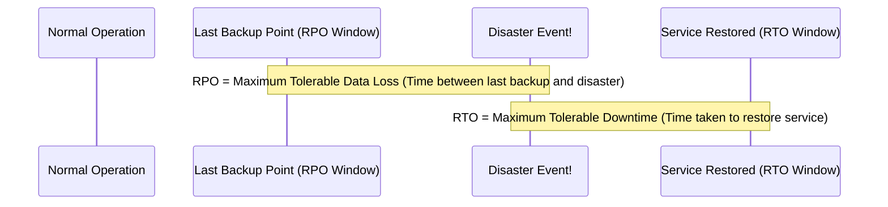

---
tags:
  - aws/architecture
  - aws/resilience
  - aws/dr
domain: Resilience
status: evergreen
exam_priority: ⭐⭐⭐⭐⭐
---

# RTO & RPO Comparison

> [!abstract] Overview
> **Recovery Time Objective (RTO)** and **Recovery Point Objective (RPO)** are the two fundamental metrics that govern Business Continuity and Disaster Recovery (BC/DR) architecture design.

---

## ⏱️ RTO vs RPO Timeline Visual

---

## 📐 Definitions & Mathematical Impact

### 1. Recovery Point Objective (RPO)
- **Definition**: The maximum acceptable amount of data loss measured in time.
- **Question it answers**: *"How much data can we afford to lose?"*
- **Architectural Levers**:
  - Infrequent daily backups $\rightarrow$ **RPO = 24 hours** (High data loss).
  - Snapshot lifecycle every 1 hour $\rightarrow$ **RPO = 1 hour**.
  - Synchronous / Continuous asynchronous database replication $\rightarrow$ **RPO $< 1\text{ second}$** (e.g., [[Amazon RDS & Aurora|Aurora Global Database]]).

### 2. Recovery Time Objective (RTO)
- **Definition**: The maximum acceptable duration of time system can be offline before service is restored.
- **Question it answers**: *"How long can the system be down before business suffers unacceptable harm?"*
- **Architectural Levers**:
  - Rebuilding servers manually $\rightarrow$ **RTO = Days**.
  - Infrastructure as Code (CloudFormation / CDK) automation $\rightarrow$ **RTO = 30-60 minutes**.
  - Auto Scaling Group health check failover $\rightarrow$ **RTO = 2-5 minutes**.
  - Multi-Region DNS failover with Route 53 $\rightarrow$ **RTO $< 1\text{ minute}$**.

---

## ⚡ High-Yield Exam Tips

> [!tip] Exam Rule of Thumb
> - Whenever an exam question states **"RPO in seconds"** or **"RPO $< 1\text{ minute}$"**, you **MUST** choose continuous replication (Aurora Global Database, DynamoDB Global Tables, S3 Cross-Region Replication). Standard periodic backups will fail this requirement.
> - Lower RTO & RPO values require higher cloud spending; always select the most cost-effective option that satisfies the stated RTO/RPO limits.

---

## 🔗 Related Notes
- [[High Availability & DR Strategies]]
- [[Well-Architected Framework MOC]]
- [[Reliability Pillar]]
