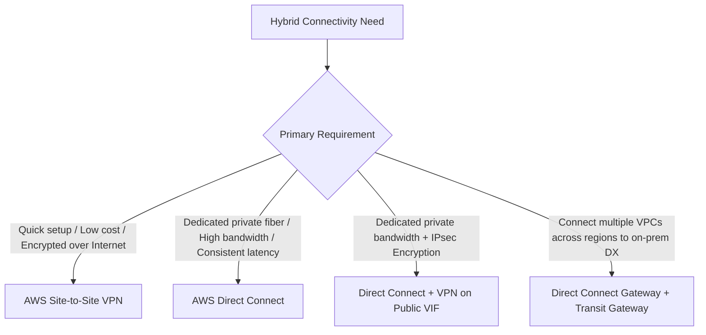
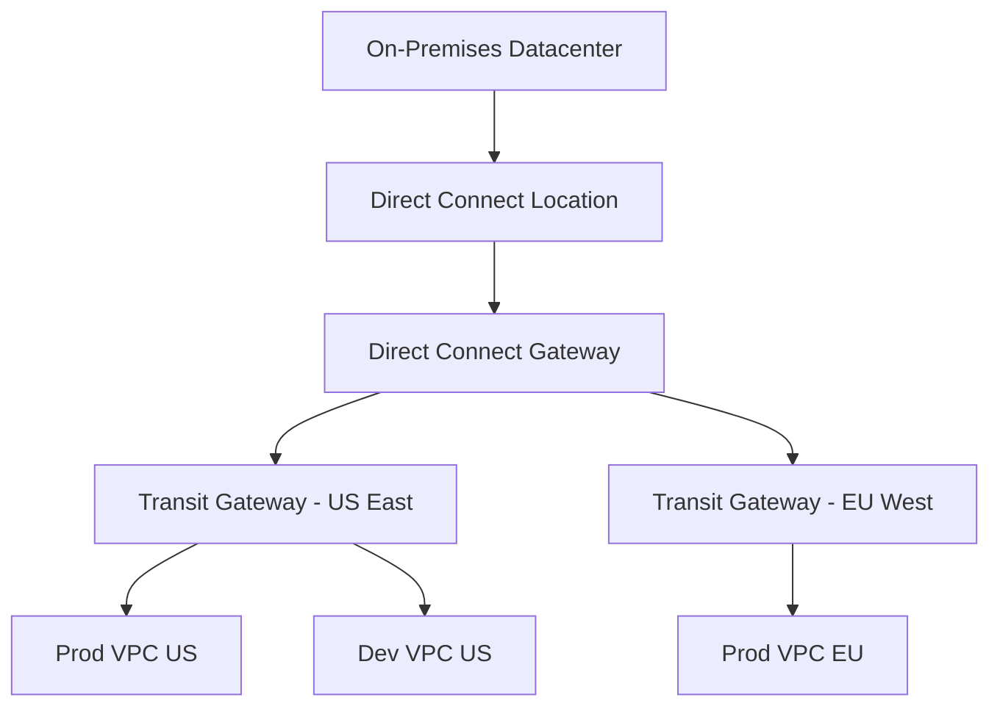

---
tags:
  - aws/matrix
  - aws/networking
  - aws/hybrid
  - aws/exam-high-priority
status: evergreen
---

# Decision Matrix: Hybrid Connectivity

> [!abstract] Overview
> Decision guide for connecting on-premises data centers and branch offices to the AWS Cloud using AWS Site-to-Site VPN, AWS Direct Connect (DX), AWS Transit Gateway, and AWS Direct Connect Gateway.

---

## 🧭 Hybrid Connectivity Decision Flowchart

---

## 📊 Hybrid Connection Comparison

| Feature | AWS Site-to-Site VPN | AWS Direct Connect (DX) | DX with VPN (Encrypted DX) |
| :--- | :--- | :--- | :--- |
| **Physical Medium** | Public Internet (IPsec tunnel) | Dedicated private physical fiber | Dedicated fiber + IPsec tunnel |
| **Setup Time** | **Minutes** | **Weeks to Months** (telecom provisioning)| Weeks to Months |
| **Encryption** | **Encrypted by default (IPsec AES-256)**| ❌ **Unencrypted by default** | **Fully Encrypted (IPsec over DX)** |
| **Bandwidth / Throughput**| Up to 1.25 Gbps per tunnel | **1 Gbps, 10 Gbps, 100 Gbps** | Up to 1.25 Gbps (or MACsec at line rate)|
| **Network Consistency** | Subject to public internet fluctuations | **Predictable, ultra-consistent low latency**| Consistent private latency + encryption |
| **Cost Profile** | Low (Hourly connection fee + standard data)| High (Port hour fee + telecom cross-connect)| High |

---

## 🏢 Scaling Multi-VPC Hybrid Architectures

1. **Direct Connect Gateway (DXGW)**:
   - Connects an on-premises Direct Connect location to **multiple VPCs in any AWS Region** (excluding China).
2. **Transit Gateway + Direct Connect**:
   - Attach Transit Gateway to Direct Connect Gateway via a **Transit Virtual Interface (Transit VIF)**.
   - Enables thousands of VPCs across multiple regions to communicate with on-premises networks over a single Direct Connect connection.

---

## ⚡ Instant Exam Clues

| Exam Clue / Keyword | Correct Connectivity Decision |
| :--- | :--- |
| *"Immediate secure hybrid connection needed within hours at minimum cost"* | **AWS Site-to-Site VPN** |
| *"High-bandwidth, dedicated private network connection with predictable performance"* | **AWS Direct Connect (DX)** |
| *"Direct Connect is required, but data in transit MUST be IPsec encrypted"* | **Direct Connect + Site-to-Site VPN on Public VIF (or MACsec)** |
| *"Connect on-premise datacenter to multiple VPCs across different AWS regions over Direct Connect"* | **Direct Connect Gateway** |
| *"Cost-effective backup connection for Direct Connect in case of fiber failure"* | **Site-to-Site VPN as Failover Backup** |

---

## 🔗 Related Notes
- [[Networking MOC]]
- [[VPC Peering vs Transit Gateway vs PrivateLink]]
- [[VPC Architecture & Subnets]]
