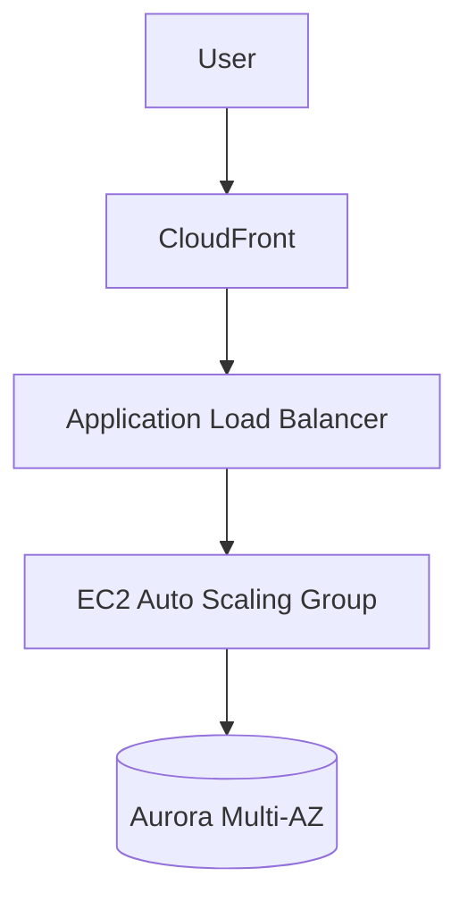

---
tags:
  - aws/scenario
  - aws/practice
domain: Architecture
status: seedling
difficulty: Medium # Low | Medium | High
exam_source: SAA-C03 # SAA-C03 | SAP-C02
---

# Scenario: {{title}}

> [!question] The Problem
> Paste or describe the scenario question here, including all hard constraints (RPO, RTO, latency, budget, compliance).

---

## 🎯 Requirements Breakdown
- **Functional Requirements**:
- **Non-Functional Requirements**:
  - Availability / SLA:
  - RPO / RTO:
  - Cost Constraints:
  - Security / Compliance:

---

## 🧠 Architectural Decision & Analysis

### Why Option A is Correct:
- Key justification based on AWS best practices.

### Why Distractors are Wrong:
- **Option B**: Why it fails (e.g., higher cost, violates RPO).
- **Option C**: Why it fails (e.g., does not meet scaling requirement).
- **Option D**: Why it fails.

---

## 🔗 Related Service Notes
- [[00 - Home|Master Index]]
- [[EC2 - Elastic Compute Cloud]]
- [[Amazon RDS & Aurora]]
