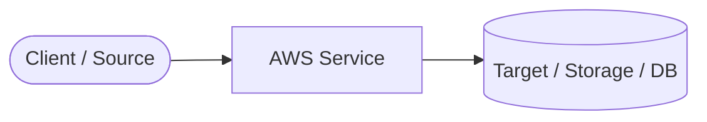

---
tags:
  - aws/service
  - aws/domain-placeholder
domain: Compute # Compute | Storage | Database | Networking | Security | Integration | Management
status: seedling # seedling | growing | evergreen
exam_priority: ⭐⭐⭐⭐ # ⭐ to ⭐⭐⭐⭐⭐
last_reviewed: 2026-08-24
---

# {{title}}

> [!abstract] Service Overview
> Concise 2-3 sentence definition of what this service is, what problem it solves, and its core architectural function.

---

## 🏛️ Core Architecture & Components

### Key Concepts
- **Concept 1**: Detailed explanation.
- **Concept 2**: Detailed explanation.
- **Scaling / Resilience Model**: How high availability and fault tolerance are handled.

---

## ⚡ High-Yield Exam Patterns & Rules

> [!tip] High-Yield Exam Keyword Match
> - **Keyword X** $\rightarrow$ Use **{{title}}**
> - **Keyword Y** $\rightarrow$ Look for **Specific Feature**

> [!warning] Exam Traps & Common Distractors
> - Do not confuse with alternatives when the question specifies requirement Z.
> - Common anti-pattern: Anti-pattern description.

---

## 📊 Comparison & Trade-offs

| Feature / Dimension | {{title}} | Alternative Service |
| :--- | :--- | :--- |
| **Primary Use Case** | | |
| **Pricing Model** | | |
| **Performance / Latency** | | |
| **Operational Overhead**| | |

---

## 💡 Real-World Architectural Scenarios

### Scenario 1: High Availability & Cost Optimization
- **Problem Statement**: 
- **Recommended Architecture**: 

---

## 🔗 Related Notes
- [[00 - Home|Master Index]]
- [[Well-Architected Framework MOC]]
- [[Decision Matrix - Database Selection]]
