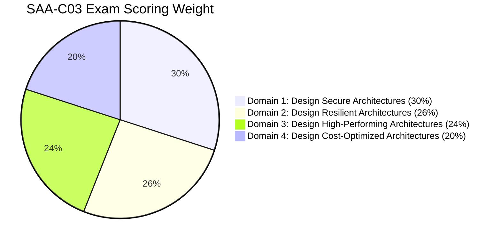
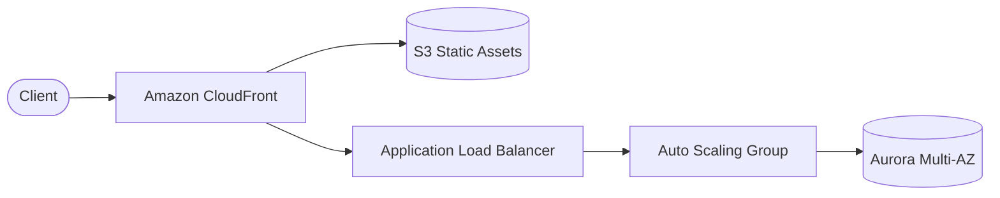
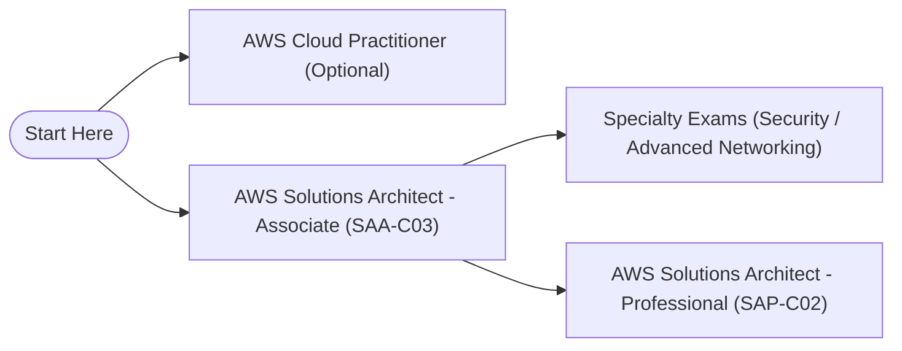

# ☁️ AWS Certified Solutions Architect Knowledge Vault

[](https://aws.amazon.com/certification/)
[](https://obsidian.md)
[](https://mermaid.js.org/)
[](https://git-scm.com/)
[](#)

> A production-grade, interconnected Second Brain and active-recall repository engineered for the **AWS Certified Solutions Architect – Associate (SAA-C03)** and **Professional (SAP-C02)** certifications. Built with cross-linked notes, architecture flowcharts, high-yield decision matrices, and exam trap breakdowns.

---

## 🎯 Purpose & Learning Strategy

Passing the AWS Solutions Architect exams requires more than rote memorization of AWS marketing material. It requires:
1. **Architectural Trade-Off Analysis**: Evaluating Cost vs. Performance vs. Resiliency vs. Operational Overhead.
2. **Keyword & Pattern Recognition**: Identifying the "hidden requirements" in exam scenarios (e.g., *"lowest operational overhead"*, *"millisecond latency with multi-region replication"*, *"cost-effective archival with rapid retrieval"*).
3. **Deep Conceptual Interlinking**: Understanding how storage, compute, networking, and security integrate to form resilient enterprise topologies.

This repository is organized to serve **two environments simultaneously**:
- **In [Obsidian](https://obsidian.md)**: As a dynamic, bi-directionally linked knowledge graph with Maps of Content (MOCs), visual canvas/graph views, native Mermaid diagrams, and callouts.
- **On [GitHub](https://github.com)**: As a clean, human-readable documentation hierarchy with fast navigation, code blocks, and markdown tables.

---

## 🗺️ Vault Architecture & Directory Structure

```text
aws-learning/
├── .obsidian/                           # Vault configuration (wikilinks, asset routing)
├── 00 - Home.md                         # Master Vault Landing Hub & Knowledge Graph Core
├── 00 - Inbox/                          # Staging ground for rapid study capture & exam clippings
│   └── README.md
├── 01 - Well-Architected Framework/     # The 6 Pillars, lenses, and design principles
│   ├── Well-Architected Framework MOC.md
│   └── [6 Pillar Deep Dives]...
├── 02 - Compute/                        # EC2, Auto Scaling, Lambda, ECS, EKS, Fargate, App Runner
│   ├── Compute MOC.md
│   └── [Compute Service Notes]...
├── 03 - Storage/                        # S3 Deep Dive, EBS, EFS, FSx, Storage Gateway, DataSync
│   ├── Storage MOC.md
│   └── [Storage Service Notes]...
├── 04 - Databases/                      # RDS, Aurora, DynamoDB, ElastiCache, MemoryDB, Redshift
│   ├── Databases MOC.md
│   └── [Database Service Notes]...
├── 05 - Networking & Content Delivery/  # VPC, Subnets, Route 53, CloudFront, Gateways, TGW
│   ├── Networking MOC.md
│   └── [Networking Service Notes]...
├── 06 - Security, Identity & Compliance/# IAM, SCPs, KMS, Secrets Manager, GuardDuty, Macie
│   ├── Security MOC.md
│   └── [Security Service Notes]...
├── 07 - Application Integration/       # SQS, SNS, EventBridge, Step Functions, Kinesis
│   ├── Integration MOC.md
│   └── [Messaging & Decoupling Notes]...
├── 08 - Monitoring & Governance/        # CloudWatch, CloudTrail, Config, Systems Manager
│   ├── Monitoring MOC.md
│   └── [Governance Service Notes]...
├── 09 - Disaster Recovery & HA/         # RTO/RPO strategies, Multi-AZ vs Multi-Region
│   ├── High Availability & DR Strategies.md
│   └── RTO & RPO Comparison.md
├── 10 - Decision Matrices & Cheat Sheets/# Fast-lookup exam matrices & keyword pairings
│   ├── Decision Matrix - Database Selection.md
│   ├── Decision Matrix - Storage Services.md
│   ├── Decision Matrix - Decoupling & Messaging.md
│   ├── Decision Matrix - Hybrid Connectivity.md
│   └── SAA-C03 High-Yield Exam Cheat Sheet.md
├── 11 - Templates/                      # Standardized templates for new services & scenarios
│   ├── Template - Service Deep Dive.md
│   └── Template - Architecture Scenario.md
├── assets/                              # Screenshots, architecture diagrams, media attachments
│   └── README.md
├── .gitignore                           # Excludes OS junk, cloud sync locks, & private credentials
├── AGENTS.md                            # Obsidian conventions & autonomous agent directives
└── README.md                            # Repository master index & Git documentation
```

---

## 📂 Domain Navigation Hub

| Domain | Folder & Master MOC | Core Topics Covered |
| :--- | :--- | :--- |
| **00. Master Hub** | [00 - Home.md](00%20-%20Home.md) | Central vault index, mindmaps, and global linking hub |
| **00. Inbox** | [00 - Inbox/](00%20-%20Inbox/README.md) | Fleeting capture, practice test question triage, and raw notes |
| **01. Well-Architected** | [Well-Architected Framework MOC](01%20-%20Well-Architected%20Framework/Well-Architected%20Framework%20MOC.md) | Operational Excellence, Security, Reliability, Performance, Cost, Sustainability |
| **02. Compute** | [Compute MOC](02%20-%20Compute/Compute%20MOC.md) | EC2, Launch Templates, ALB/NLB/GLB, Auto Scaling, Lambda, ECS/EKS/Fargate |
| **03. Storage** | [Storage MOC](03%20-%20Storage/Storage%20MOC.md) | S3 Classes & Lifecycle, EBS Volume Types, EFS, FSx (Lustre/Windows/ONTAP), Storage Gateway |
| **04. Databases** | [Databases MOC](04%20-%20Databases/Databases%20MOC.md) | RDS Multi-AZ vs Read Replicas, Aurora Global, DynamoDB DAX & Streams, ElastiCache, MemoryDB |
| **05. Networking** | [Networking MOC](05%20-%20Networking%20&%20Content%20Delivery/Networking%20MOC.md) | VPC CIDR design, Public/Private Subnets, NAT GW, Transit Gateway, Route 53, CloudFront |
| **06. Security** | [Security MOC](06%20-%20Security,%20Identity%20&%20Compliance/Security%20MOC.md) | IAM Policies, Cross-Account Roles, Organizations & SCPs, KMS envelope encryption, Macie |
| **07. Integration** | [Integration MOC](07%20-%20Application%20Integration%20&%20Messaging/Integration%20MOC.md) | SQS Standard vs FIFO, SNS Fan-out, EventBridge Event Buses, Step Functions, Kinesis Streams |
| **08. Governance** | [Monitoring MOC](08%20-%20Monitoring%20&%20Governance/Monitoring%20MOC.md) | CloudWatch Metrics/Alarms, CloudTrail auditing, AWS Config compliance rules, SSM Parameter Store |
| **09. Resilience** | [High Availability & DR Strategies](09%20-%20Disaster%20Recovery%20&%20High%20Availability/High%20Availability%20&%20DR%20Strategies.md) | RTO/RPO calculation, Backup & Restore, Pilot Light, Warm Standby, Multi-Site Active-Active |
| **10. Cheat Sheets** | [Decision Matrices & Cheat Sheets](10%20-%20Decision%20Matrices%20&%20Cheat%20Sheets/) | High-yield keyword matchers, exam distractor traps, and side-by-side service matrices |

---

## ⚡ High-Yield Decision Matrices & Cheat Sheets

The core exam weapons are located in `10 - Decision Matrices & Cheat Sheets/`:

1. **[Database Selection Matrix](10%20-%20Decision%20Matrices%20&%20Cheat%20Sheets/Decision%20Matrix%20-%20Database%20Selection.md)**:
   - When to choose **Aurora** vs. **RDS** vs. **DynamoDB** vs. **ElastiCache** vs. **MemoryDB** vs. **Redshift**.
2. **[Storage Services Matrix](10%20-%20Decision%20Matrices%20&%20Cheat%20Sheets/Decision%20Matrix%20-%20Storage%20Services.md)**:
   - File (EFS/FSx) vs. Block (EBS/Instance Store) vs. Object (S3) vs. Hybrid (Storage Gateway Volume/File/Tape).
3. **[Decoupling & Messaging Matrix](10%20-%20Decision%20Matrices%20&%20Cheat%20Sheets/Decision%20Matrix%20-%20Decoupling%20&%20Messaging.md)**:
   - Compare throughput, ordering, retention, and delivery semantics across **SQS**, **SNS**, **EventBridge**, **Kinesis**, and **Step Functions**.
4. **[Hybrid Connectivity Matrix](10%20-%20Decision%20Matrices%20&%20Cheat%20Sheets/Decision%20Matrix%20-%20Hybrid%20Connectivity.md)**:
   - IPSec VPN vs. Direct Connect (DX) vs. Transit Gateway (TGW) vs. VPC Peering vs. AWS PrivateLink.
5. **[RTO & RPO Comparison](09%20-%20Disaster%20Recovery%20&%20High%20Availability/RTO%20&%20RPO%20Comparison.md)**:
   - Disaster Recovery tiering cost curve from hours down to sub-second recovery.
6. **[SAA-C03 High-Yield Exam Cheat Sheet](10%20-%20Decision%20Matrices%20&%20Cheat%20Sheets/SAA-C03%20High-Yield%20Exam%20Cheat%20Sheet.md)**:
   - Direct exam keyword associations (e.g. *"Audit API calls"* $\rightarrow$ **CloudTrail**, *"Unmanaged state across EC2"* $\rightarrow$ **DynamoDB/ElastiCache**).

---

## 📊 SAA-C03 Exam Blueprint Breakdown



### Recommended Study Progression
1. **Phase 1: Foundations & Core Architecture**
   - Review [01 - Well-Architected Framework](01%20-%20Well-Architected%20Framework/Well-Architected%20Framework%20MOC.md).
   - Deep dive into compute primitives in [02 - Compute](02%20-%20Compute/Compute%20MOC.md) and block/object storage in [03 - Storage](03%20-%20Storage/Storage%20MOC.md).
2. **Phase 2: Networking & Security Perimeter**
   - Master VPC subnetting, route tables, and gateways in [05 - Networking](05%20-%20Networking%20&%20Content%20Delivery/Networking%20MOC.md).
   - Solidify IAM delegation, SCPs, and KMS envelope encryption in [06 - Security](06%20-%20Security,%20Identity%20&%20Compliance/Security%20MOC.md).
3. **Phase 3: Stateful Systems, Integration & Resilience**
   - Map database engines and caching tiers in [04 - Databases](04%20-%20Databases/Databases%20MOC.md).
   - Build decoupled, event-driven designs with SQS/SNS/EventBridge in [07 - Application Integration](07%20-%20Application%20Integration%20&%20Messaging/Integration%20MOC.md).
   - Calculate RTO/RPO and multi-region failover in [09 - Disaster Recovery](09%20-%20Disaster%20Recovery%20&%20High%20Availability/High%20Availability%20&%20DR%20Strategies.md).
4. **Phase 4: Synthesis, Speed & Practice Exams**
   - Drill the [Decision Matrices](10%20-%20Decision%20Matrices%20&%20Cheat%20Sheets/).
   - Review the [SAA-C03 High-Yield Exam Cheat Sheet](10%20-%20Decision%20Matrices%20&%20Cheat%20Sheets/SAA-C03%20High-Yield%20Exam%20Cheat%20Sheet.md).
   - Simulate practice exam questions and file confusing questions directly into [00 - Inbox/](00%20-%20Inbox/README.md).

---

## 💎 Using This Vault in Obsidian

### 1. Opening the Vault
1. Launch [Obsidian](https://obsidian.md).
2. Click **Open folder as vault**.
3. Select this repository root directory (`aws-learning`).
4. Obsidian will automatically recognize the pre-configured `.obsidian/app.json`:
   - Internal links use `[[Wikilinks]]`.
   - Pasted images, diagrams, and assets are automatically stored cleanly in `assets/`.

### 2. Recommended Community Plugins
To maximize the power of this knowledge vault, consider enabling these community plugins:
- **[Dataview](https://github.com/blacksmithgu/obsidian-dataview)**: Query notes by YAML tags (e.g. `tags: aws/service`, `domain: Compute`).
- **[Obsidian Git](https://github.com/Vinzent03/obsidian-git)**: Automatically stage, commit, and push note updates from desktop or mobile.
- **[Omnisearch](https://github.com/scambier/obsidian-omnisearch)**: Lightning-fast indexed search across all AWS architectural notes and PDFs.
- **[Templater](https://github.com/SilentVoid13/Templater)**: Dynamically insert templates from `11 - Templates/` with pre-filled frontmatter.

### 3. Graph View Navigation
Open Obsidian's **Graph View** (`Cmd/Ctrl + G`) to see your knowledge web evolve. 
- Filter by `#aws/moc` to visualize the primary hub nodes.
- Color group by `#aws/compute`, `#aws/storage`, `#aws/database`, `#aws/networking`, `#aws/security`.

---

## 🛠️ Using This Vault with Git

### Git Hygiene & `.gitignore`
The repository contains a battle-tested `.gitignore` specifically designed for Obsidian vaults and cloud-synced filesystems:
- **Obsidian Workspace State Ignored**: `.obsidian/workspace.json`, `.obsidian/cache/`, and `.trash/` are excluded to prevent noisy merge conflicts across multiple machines.
- **OS Artifacts Ignored**: Cleans up macOS `.DS_Store`, Windows `Thumbs.db`, and temporary files.
- **Cloud Sync Protected**: Prevents conflict files if the repository is stored inside Google Drive, OneDrive, or iCloud (`*.tmp.drivedownload`, `Icon\r`).
- **Secrets & Credentials Blocked**: Hardened to block accidental commits of `.env`, `*.pem`, `*credentials`, and `terraform.tfvars`.

### Recommended Daily Workflow
```bash
# Pull the latest notes
git pull origin main

# Create a topic branch for a new study session or service deep-dive
git checkout -b study/aurora-global-database

# After writing notes and testing architectural scenarios
git status
git add .
git commit -m "docs(database): add aurora global database failover and replication lag notes"

# Merge into main
git checkout main
git merge study/aurora-global-database
git push origin main
```

---

## 📝 Note Standards & Conventions

All notes adhere to the guidelines documented in [AGENTS.md](AGENTS.md):

### 1. YAML Frontmatter
Every note starts with standard metadata:
```yaml
---
title: "Service or Scenario Name"
date: YYYY-MM-DD
tags:
  - aws/domain
  - aws/service
status: evergreen # seedling | growing | evergreen | archive
aliases: []
---
```

### 2. Obsidian Wikilinks
Always link related AWS services:
```markdown
Combine [[EC2 Auto Scaling & Load Balancing]] with [[Amazon Aurora]] to build a resilient tier.
```

### 3. Architecture Diagrams (Mermaid)
Visualize multi-tier flows using clear, directional graphs:


### 4. Obsidian Callouts
Highlight critical exam takeaways and pitfalls:
```markdown
> [!tip] Exam Tip
> Remember that Snowball Edge Storage Optimized provides block and object storage, while Snowcone is portable and ultra-lightweight.

> [!warning] Architecture Pitfall
> S3 Transfer Acceleration requires public Internet routing and cannot be used over private AWS Direct Connect connections.
```

---

## 🏆 Master Certification Roadmap



Happy studying and building resilient, secure, and cost-effective cloud architectures!
